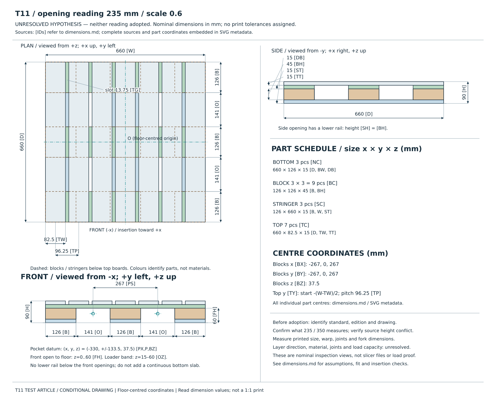
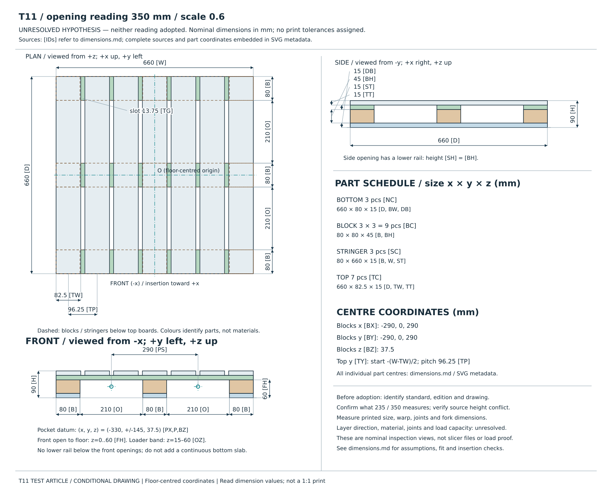

# T11 ×0.6 시험체 조건부 도면 — 두 삽입구 해석

**235 mm와 350 mm 중 어느 쪽도 채택하지 않았다.** 각각을 원형의 개구 순폭이라고 가정한
명목 치수 도면이다. 표준 원문을 조회하지 않았으며 **표준 원문 확인 필요** 상태를 유지한다.
기존 실행용 기하·prior는 수정하지 않았다. 생성된 `geometry.yaml`은 기존 스키마의
해석별 출력 사본이며 새 기하 정본이나 검출기 회귀 상수가 아니다.

근거는 [ADR 0002](../decisions/0002-test-pallet-and-geometry-generality.md):194–204다.
채택 전에 KS T 1372 / JIS Z 0601 / KS T ISO 6780·ISO 6780 중 인용할 **표준 번호·판본·도면**을
특정하고, 그 도면의 삽입구 치수가 **개구 순폭인지, 블록 간 중심거리인지, 다른 대상인지** 확인해야 한다.
이 문서는 표준의 적용관계나 원문 문구를 확정하지 않는다.

또한 [입력 YAML](../../config/pallet_geometry_t11_06.yaml):4의 원형 높이 144 mm는
같은 파일 :24의 90 mm ÷ :8의 축척 0.6 = 150 mm 및 ADR :194와 서로 다르다.
이번 도면은 **실제 YAML 필드**를 사용했다. 높이와 판재·블록 세부 치수의 표준 일치 여부도 확인해야 한다.

## 도면과 전체 치수표

각 SVG에 평면도·정면도·측면도, 치수선, 포켓 기준점, 부품 크기와 배치 요약을 넣었다.
치수 옆 `[ID]`는 같은 묶음의 치수표와 연결되며, 전체 출처와 좌표가 SVG metadata에도 들어 있다.
도면의 모든 수치는 mm 단위의 명목값이다. 화면·용지의 길이를 직접 재지 않고 치수값을 읽는다.

### 235 mm를 원형 개구 순폭으로 읽은 경우



[SVG 원본](assets/t11_2026_09_17/reading_235/drawing.svg) ·
[전체 치수표와 부품별 좌표](assets/t11_2026_09_17/reading_235/dimensions.md) ·
[계산 결과와 출처 해시](assets/t11_2026_09_17/reading_235/verification.json)

### 350 mm를 원형 개구 순폭으로 읽은 경우



[SVG 원본](assets/t11_2026_09_17/reading_350/drawing.svg) ·
[전체 치수표와 부품별 좌표](assets/t11_2026_09_17/reading_350/dimensions.md) ·
[계산 결과와 출처 해시](assets/t11_2026_09_17/reading_350/verification.json)

### 두 해석의 치수 요약

표의 길이·좌표는 mm, 개수 행은 개수다. 출처 경로는 저장소 루트 기준이다.
상·하 덱을 비롯한 판재 두께·상판 개수·폭은 기존 시험체의 **설계 선택값**이며 표준치가 아니다
(`config/pallet_geometry_t11_06.yaml:11–14,26–30,42–45`; ADR 0002:201–204).

| 항목 | 235 해석 | 350 해석 | 출처 / 유도식 |
|---|---|---|---|
| 전체 폭 y | 660 | 660 | config/pallet_geometry_t11_06.yaml:22 (overall_width_m) × (0.6/0.6) [--scale/--source-scale] |
| 전체 깊이 x | 660 | 660 | config/pallet_geometry_t11_06.yaml:23 (overall_depth_m) × (0.6/0.6) [--scale/--source-scale] |
| 전체 높이 z | 90 | 90 | config/pallet_geometry_t11_06.yaml:24 (overall_height_m) × (0.6/0.6) [--scale/--source-scale] |
| 하부 판재 두께 | 15 | 15 | config/pallet_geometry_t11_06.yaml:27 (deck_bottom_m) × (0.6/0.6) [--scale/--source-scale] |
| 스트링거 두께 | 15 | 15 | config/pallet_geometry_t11_06.yaml:29 (stringer_m) × (0.6/0.6) [--scale/--source-scale] |
| 상부 판재 두께 | 15 | 15 | config/pallet_geometry_t11_06.yaml:30 (top_board_thickness_m) × (0.6/0.6) [--scale/--source-scale] |
| 상부 덱 합계 (스트링거+상판) | 30 | 30 | ST + TT |
| 각 블록 폭 y = 깊이 x | 126 | 80 | (W − 2×O)/3; 같은 폭의 지지대 3개 가정; docs/decisions/0002-test-pallet-and-geometry-generality.md:195; docs/decisions/0002-test-pallet-and-geometry-generality.md:196 |
| 블록 높이 / 로더 개구 높이 | 45 | 45 | config/pallet_geometry_t11_06.yaml:28 (block_height_m) × (0.6/0.6) [--scale/--source-scale] |
| 하부 판재 각각의 폭 | 126 | 80 | B와 동일; src/forklift_core/perception/pallet_geometry.py:55 |
| 블록 수 | 3 × 3 = 9 | 3 × 3 = 9 | config/pallet_geometry_t11_06.yaml:34 (block_widths_m); tools/build_pallet_model.py:34 |
| 하부 판재 수 | 3 | 3 | tools/build_pallet_model.py:34; 각 블록 y열에 하나 |
| 스트링거 수 | 3 | 3 | tools/build_pallet_model.py:34; 각 블록 x행에 하나 |
| 상부 판재 수 (설계 선택값) | 7 | 7 | config/pallet_geometry_t11_06.yaml:44 (top_board_count) |
| 상부 판재 폭 | 82.5 | 82.5 | config/pallet_geometry_t11_06.yaml:45 (top_board_width_m) × (0.6/0.6) [--scale/--source-scale] |
| 상부 판재 중심 피치 | 96.25 | 96.25 | (W − TW)/(TC − 1) |
| 상부 판재 사이 슬롯 | 13.75 | 13.75 | TP − TW |

| 항목 | 235 해석 | 350 해석 | 출처 / 유도식 |
|---|---|---|---|
| 두 개구 각각의 순폭 (조건부) | 141 | 210 | 235: CLI --opening-reading 235 mm × --scale 0.6; docs/decisions/0002-test-pallet-and-geometry-generality.md:195; docs/decisions/0002-test-pallet-and-geometry-generality.md:196; 350: CLI --opening-reading 350 mm × --scale 0.6; docs/decisions/0002-test-pallet-and-geometry-generality.md:195; docs/decisions/0002-test-pallet-and-geometry-generality.md:196 |
| 로더 개구 z 대역 | 15–60 | 15–60 | [DB, DB+BH]; src/forklift_core/perception/pallet_geometry.py:89 |
| 정면 통로: 바닥부터 천장까지 | 60 | 60 | DB+BH; 정면 개구 아래 판재 없음; tools/build_pallet_model.py:34 |
| 측면 개구 순높이 | 45 | 45 | BH; 측면 아래에는 하부 판재가 가로지름; tools/build_pallet_model.py:34 |
| 전면 포켓 중심 x | -330 | -330 | −D/2; 삽입은 전면 −x에서 +x 방향 |
| 포켓 중심 y 절댓값 | 133.5 | 145 | (B + O)/2 |
| 블록 중심 z = 포켓 중심 z | 37.5 | 37.5 | DB + BH/2 |
| 포켓 중심 간격 | 267 | 290 | 2×P |
| 블록 / 스트링거 x 중심 | -267, 0, 267 | -290, 0, 290 | [−(D−B)/2, 0, +(D−B)/2]; tools/build_pallet_model.py:34 |
| 블록 / 하부 판재 y 중심 | -267, 0, 267 | -290, 0, 290 | [−(W−B)/2, 0, +(W−B)/2]; tools/build_pallet_model.py:34 |
| 상부 판재 y 중심 | -288.75, -192.5, -96.25, 0, 96.25, 192.5, 288.75 | -288.75, -192.5, -96.25, 0, 96.25, 192.5, 288.75 | −(W−TW)/2 + i×TP; i=0…TC−1; tools/build_pallet_model.py:34 |

좌표는 바닥 외형 중심 원점, x 삽입 방향·y 전면 폭·z 위다(입력 YAML:19).
전면 x=−D/2에서 +x로 삽입하며 포켓 기준점은 (PX, ±P, BZ)다.
블록·스트링거·판재의 개별 크기와 중심 좌표는 각 전체 치수표에 전부 기재했다.
조립은 기존 `tools/build_pallet_model.py:34–85`의 `pallet_boxes`를 그대로 사용한다.

**개구 높이는 측정 대상을 구분한다.** 로더의 개구 대역은 z=15–60 mm, 높이 45 mm다
(DB=15, BH=45 → [DB, DB+BH]; `pallet_geometry.py:85–90`). 정면의 아래 열린 통로는
z=0–60 mm다(DB+BH; `build_pallet_model.py:45–72`). 측면은 아래 판재가 가로지르므로
z=15–60 mm의 개구다. 따라서 같은 블록 배치를 썼더라도 **덱 구조까지 회전 대칭인 것은 아니다.**
로더 포켓 기준점의 z=37.5 mm(DB+BH/2)를 실제 정면 통로의 면적 중심으로 바꾸지 않았다.

### 차이와 유도

[전체 차이표](assets/t11_2026_09_17/reading_235/comparison.md)는 235 해석 − 350 해석으로 계산한다.
원형 외형 1100 mm와 동일 지지대 세 개라는 조건부 배치는 ADR 0002:194–196에서 왔다.

- 235 해석: 원형 블록 b=(1100−2×235)/3=210 mm → ×0.6에서 126 mm,
  개구=235×0.6=141 mm, 포켓 중심 y=±(126+141)/2=±133.5 mm.
- 350 해석: 원형 블록 b=(1100−2×350)/3=133⅓ mm → ×0.6에서 80 mm,
  개구=350×0.6=210 mm, 포켓 중심 y=±(80+210)/2=±145 mm.
- 따라서 개구 폭은 −69 mm, 블록 폭·깊이 및 하부 판재 폭은 +46 mm,
  포켓 중심 절댓값은 −11.5 mm, 포켓 중심 간격은 −23 mm다(각 위 값의 차).
  스트링거의 x 길이와 블록·스트링거·하부 판재 중심 배치도 B에 연동해 바뀐다.
  덱 두께·상판 배치는 입력 YAML 그대로여서 두 해석에서 같다.

## 포크 적합성

실제 `check_fork_fit`에 입력한 값이다. 단순히 포크 폭과 개구 폭만 비교하지 않았다.

| 입력 | 값 (mm) | 출처 / 유도식 |
|---|---|---|
| 포크 중심 간격 | 290 | `sim/models/dls08_provisional/parameters.yaml:24` |
| 포크 폭 | 55 | 같은 파일 :25 |
| 포크 두께 | 24 | 같은 파일 :26 |
| 최저 중심 높이 | 40 | 같은 파일 :27 |
| 승강 행정 | 280 | 같은 파일 :30 |
| 블레이드 길이 | 420 | (:13 −510) + (:8 1460) − (:23 530) |

이 값은 사진 비율 추정이며 실측이 아니다(같은 파일 :5).
포크 외곽은 y=±(290/2±55/2), 즉 양쪽에서 |y|=117.5–172.5 mm이고
최저 z 범위는 40±24/2=28–52 mm다(위 입력의 유도).

| 검사 | 235 해석 | 350 해석 | 출처 / 유도식 |
|---|---|---|---|
| 안쪽 여유 | 54.5 mm | 77.5 mm | (290−55−B)/2; `pallet_geometry.py:227` |
| 바깥쪽 여유 | 31.5 mm | 77.5 mm | B/2+O−(290+55)/2; 같은 파일 :228–232 |
| 필요 승강 | 0 mm | 0 mm | max(0, DB+4−28); 같은 파일 :234–237, 기본 여유 :204 |
| 천장 여유 | 8 mm | 8 mm | DB+BH−(40+0+24/2)=60−52 |
| lateral_ok / vertical_ok / fits | True / True / True | True / True / True | `check_fork_fit`, 같은 파일 :195–249; 각 verification.json |

**235 해석도 정렬된 잠정 블레이드가 들어간다.** 중심 간격이 포켓 중심 간격과 정확히 같지는
않아도 각 포크가 개구 경계 안에 있다. 이 계산은 실제 포크, 캐리지, 접근 궤적, 하중, 변형을 검증하지 않는다.
별도로 각 출력 부품 박스와 목표 삽입 구간의 블레이드 체적이 겹치지 않는지도 통합시험에서 확인했다.

## 검출기 prior와의 수치 대조

| 항목 | 기존 prior (mm) | 235 해석 | 350 해석 | 출처 / 유도식 |
|---|---|---|---|---|
| 개구 순폭 | [190,230] | 141: 하한보다 49 작음 | 210: 범위 안 | `config/pallet_prior_t11_06.yaml:9–11`; O; 190−141 |
| 중앙 지지대 | [65,95] | 126: 상한보다 31 큼 | 80: 범위 안 | 같은 파일 :12–14; B; 126−95 |

따라서 235 해석의 명목 형상은 현재 prior에 맞지 않는다. 표는 **기하 범위 검사**이며 영상 검출 실행 결과가 아니다.
검출기의 격자 보정까지 고려해도 기본 cell=10 mm(`pocket_detector.py:44`)일 때 개구 하한은
190−2×10=170 mm(:526), 중앙 지지대 상한은 95+2×10=115 mm(:417)다.
각각 141<170, 126>115로 여전히 벗어난다. 관측 잡음·격자화에 따른 구체적인 invalid 사유나
실센서 검출률까지 이 계산으로 확정하지 않는다. 두 해석의 prior를 운영 설정으로 채택하지 않았으며,
출력 후 실측값으로 prior를 생성해야 한다(ADR 0002:62).

## 삽입 깊이

사용자 지정 규칙은 **min(시험체 깊이×0.6, 406 mm−46 mm)**다. 여기서 앞의 0.6은 삽입 비율이며,
팔레트 축척 `--scale`과 별개다. CLI 축척을 바꾸더라도 이 삽입 비율과 포크 치수는 바뀌지 않는다.

두 해석 모두 D=660 mm(입력 YAML:23)이므로 깊이 비례 후보는 660×0.6=396 mm,
캐리지 제한 후보는 406−46=360 mm, 최종 목표는 min(396,360)=**360 mm로 같다**.
목표에서 캐리지까지 남는 거리는 406−360=46 mm다.
406 mm는 ADR 0003:133–141의 950−544 mm, 360 mm는 같은 문서 :139–141의 목표다.
이번 작업은 이 잠정 차체 규칙을 적용했으며 다른 축척에서 캐리지 전체 형상의 접촉을 재계산하지 않는다.
`check_fork_fit`의 reach_fraction=420/660≈0.6364는 블레이드 길이 비율이므로 위 삽입 한계를 대신하지 않는다.

## 출력·조립 시 확인할 항목

이 도면은 명목 부품 치수와 좌표를 검수하는 자료다. 프린터용 메시, 분할·체결 상세, 적재 허용치까지
정해진 제작 승인본은 아니다. 미확인 값을 그럴듯한 기본값으로 채우지 않았다.

- **출력 공차:** 장비·재료별 수축과 휨, 분할 출력·접합의 누적 오차를 측정한 뒤 허용값을 정한다.
  현재 수치 공차는 미정이다. 전체 외형, 각 부품의 크기·위치, 개구 최소 폭·천장, 포켓 간격을
  출력 직후와 조립 후에 확인한다. 표면 돌기·지지재 잔류물·접착제도 실제 통로를 좁힐 수 있다.
- **적층 방향:** 상판의 휨, 포크 접촉면, 블록 연결부의 전단 및 층간 분리 방향을 고려하여
  시험편으로 방향을 결정한다. 재료·레이어 높이·인필·벽 수·접합 방법의 수치는 미정이다.
- **하중 방향:** 화물의 아래쪽 하중, 포크가 받치는 위쪽 힘, 삽입 중 수평 접촉력을 구분해 확인한다.
  무부하 기하 적합성을 적재 안전성으로 해석하지 않는다. 허용 하중·안전계수·내구 횟수는 미정이다.
- **실물 포크:** 두께·최저 중심 높이·간격·승강 행정을 인쇄 전에 실측한다(ADR 0002:58).
  실제 정렬 오차·바닥 평탄도·휘어짐을 반영해 남는 여유를 다시 계산한다.

## 재생성

저장소의 editable 개발 설치와 PyYAML이 있는 환경에서 실행한다(`CONTRIBUTING.md:6절`).
출력 경로는 **존재하지 않는 새 경로**여야 한다. 기본 입력은 이미 축척된 T11 YAML이며,
스케일을 다시 곱해 작아지는 오류를 피하려고 `--scale / --source-scale`로 변환한다.

```bash
python tools/build_t11_drawing.py --opening-reading 235 --scale 0.6 \
  --geometry config/pallet_geometry_t11_06.yaml \
  --output /tmp/t11_new_235
python tools/build_t11_drawing.py --opening-reading 350 --scale 0.6 \
  --geometry config/pallet_geometry_t11_06.yaml \
  --output /tmp/t11_new_350
```

각 실행은 `drawing.svg`, `dimensions.md`, `comparison.md`, `geometry.yaml`, `verification.json`을 쓴다.
`--source-scale` 기본값은 기존 입력의 0.6이다(ADR 0002:41; YAML:8).
다른 축척으로 작성한 기존 스키마의 YAML에는 실제 입력 축척을 명시해야 한다.
예를 들어 원형 크기로 작성된 YAML은 `--source-scale 1`을 사용한다.
입력은 기존 `load_pallet_geometry`로 읽고, 조건부 변환 사본도 같은 로더로 다시 검증한다.
기존 geometry의 필드·배치 함수를 병행 재정의하지 않는다.

## 검증 기록

이 절의 시험 수치·환경 버전은 아래 명령의 실제 출력 기록이며 설계 치수의 근거와 구분한다.

- 최종 전체 회귀 명령과 실제 결과:

  ```text
  python -m pytest tests --ignore=tests/simulation -q -p no:cacheprovider
  695 passed in 233.78s (0:03:53)
  ```

- 초기 추가 시험: 스크립트가 없어서 **10 failed**를 먼저 확인했다. 구현 후 같은 시험 **10 passed**,
  입력의 원형 축척 선언 시험을 추가한 최종 전용 시험은 **11 passed**였다.
  명령: `python -m pytest tests/integration/test_t11_drawing.py -q -p no:cacheprovider`.
- 정적 검사: `python -m ruff check tools/build_t11_drawing.py tests/integration/test_t11_drawing.py`
  통과, 같은 파일에 `python -m ruff format --check` 실행 결과 **2 files already formatted**.
- 두 CLI 호출 모두 성공했고 각 묶음의 SVG·치수표·차이표·기하 사본·JSON을 확인했다.
  두 묶음을 각각 별도 임시 경로에서 다시 생성했을 때 **각 5개 파일이 바이트 단위로 같았다**.
  `verification.json`의 모든 입력·코드 SHA-256도 현재 파일과 대조해 일치했다.
- 실제 SVG 렌더: `rsvg-convert .../reading_235/drawing.svg -o /tmp/t11_final_235.png`,
  `rsvg-convert .../reading_350/drawing.svg -o /tmp/t11_final_350.png`가 모두 성공했다.
  **최종 렌더 두 장을 직접 열어** 평면·정면·측면, 치수선과 화살표, 작은 판재 치수,
  포켓 기준점, 글자 겹침과 잘림을 확인했다. 각 SVG의 치수선은 **23개**다
  (`line[class=dimension]`을 XML 파서로 집계). SVG XML 파싱과 직접 시각 검사를 구분해 수행했다.
- 별도 Codex 읽기 전용 코드 리뷰에서 주요 수치·API·덮어쓰기 결함은 지적되지 않았다.
  비교표가 350 해석에 235 식만 표시한다는 출처 지적은 수용해 양쪽 유도식을 표시했고,
  양쪽 CLI 해석이 출처에 모두 포함되는지 시험에 추가했다. 수치 결론에는 의견 차이가 없었다.
- 구현 시점 기준 revision: `33667fdfe9f3e4e4b7f0cfb2a669c398ee407961` + 이번 신규 파일.
  입력 및 실행 코드 식별은 각 `verification.json`의 파일별 SHA-256을 따른다.
- 확인 환경: `python --version`/패키지 metadata 조회 결과 Python **3.11.7**, pytest **9.1.0**,
  PyYAML **6.0.3**, NumPy **2.4.6**, Ruff **0.16.6**.
  `rsvg-convert --version` 결과 **2.62.3**. 설치 요구 버전이 아니라 이번 실행 환경 기록이다.
- 표준 원문 검증, 실센서 검출, 실물 포크 측정, 프린터 출력·조립, 하중 시험은 수행하지 않았다.
  커밋·스테이징도 수행하지 않았다.
