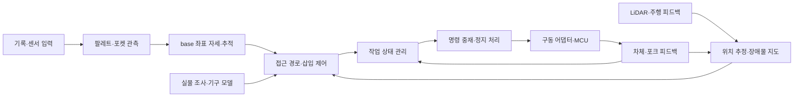

# 지게차 전체 개발 로드맵

작성일: 2026-09-11 · 대상: 2026-2 임베설 리보틱스 팀.

**목표:** 팔레트와 포켓을 관측하고 장애물·실제 차체 제약을 고려해 접근·삽입·적재한 뒤 목적지로 이동·하역한다. A–D 네 조건에서 동작을 검증하고, 성공률과 비접촉 조건을 유지하면서 작업 시간을 줄인다.

**현재 기준선:** [개발 중간 정리](../validation/2026-09-11-development-checkpoint.md). 환경·정적 합성 센서 기록/재생까지 완료됐으며 인식·주행·MCU 제어는 미구현이다.

**문서 성격:** 전체 개발 순서와 단계별 완료 조건을 정하는 제안이다. 새 로봇 기능을 구현한 문서나 확정 납기표가 아니다. 각 단계 착수 시 좁은 설계·구현 계획으로 나눈다. 사용자 확인에 따라 전체 15주 수업 중 시험·공휴일 등을 제외한 약 12개 개발 주차를 기준으로 한다. 아래 주차는 달력상의 연속 주차가 아니라 유효 개발 시간의 배분이다. 현재 이후 필요한 작업을 이 예산에 배치했으며, 이미 소비한 유효 개발 시간이 있으면 같은 예산에서 차감해 재배분한다. 최종 시연 날짜·팀원 수·실물 입고일은 확인 후 반영한다.

## 1. 개발 전략

| 접근 | 장점과 비용 | 판단 |
|---|---|---|
| 직진 A의 인식→적재→이송→하역을 먼저 완성하고 B·C·D로 확장 | 전체 시스템의 연결 문제를 일찍 드러내며 매 단계 시연 가능 | **권장** |
| 인식·SLAM·계획·제어를 각각 완성한 뒤 한 번에 통합 | 역할 분리는 쉽지만 끝에 좌표·시간·구동 제약 불일치가 몰림 | 모듈 개발은 병행하되 통합은 매주 수행 |
| 처음부터 학습 기반 인식·최적 제어·정밀 동역학을 모두 개발 | 확장성은 있지만 데이터·실물 정보·튜닝 시간이 많이 필요 | 기본 성능의 부족이 측정된 항목에 한해 추가 |

처음부터 최단 시간 보장을 주장하지 않는다. 우선 실행 가능한 비접촉 경로와 일관된 작업 성공을 확보하고, 같은 조건에서 실제 수행 시간을 비교한다. 지도·일반 주행은 검증된 ROS 구성요소를 후보로 두고, 과제의 핵심인 포켓 관측·삽입·작업 순서는 직접 구현한다.

## 2. 전체 구성과 의존 관계

로봇 수령 전에는 센서 계약·정적 장면 변형·오프라인 인식·추적 시험을 진행한다. 실물 조사와 기구 모델 검증은 실제 주행 제어의 선행 조건이다. 노트북은 편집·빠른 시험·분석, 원격은 Slurm 시뮬레이션·반복 평가, Jetson은 센서와 로봇의 실시간 상위 제어를 맡는다. MCU 또는 확인된 기존 제어기는 구동 루프·입출력·명령 만료 처리를 맡는다.

`forklift_core`는 ROS/센서 SDK와 분리한다. 공통 계약에는 관측 시각과 clock domain, frame, 포켓 두 개의 위치·방향·유효성·불확실성, 추적 상태·소실 이유를 포함한다. 실제 메시지 타입과 장치 명령 형식은 각각 해당 단계에서 고정한다. 테스트 진실값은 평가기에만 전달하고 인식기·실제 제어기의 입력으로 우회하지 않는다.

## 3. 마일스톤

### M0. 현재 기준선 정리 — 완료된 기반 + 인계 작업

정적 센서 검증은 완료됐다. 첫 실행을 재현할 수 있도록 현재 미커밋 변경과 근거를 검토해 팀에 인계한다. commit/push는 별도 요청 범위에서 수행한다. 다른 팀원이 새 checkout에서 코어 시험과 원격 dry-run을 실행할 수 있는지 확인한다.

**다음 산출물:** 검토된 기준 revision, 재현 명령, 현재 상태 문서. 현재 원격 `repo/`는 초기 checkout이며 최신 검증 코드는 실행별 snapshot에 있다는 차이도 인계한다.

### M1. 저장소 구조 전환과 평가 입력 — 실물 없이 가능

먼저 [CONTRIBUTING.md의 전환 목록](../../CONTRIBUTING.md#10-구조-전환-이력)에 따라 `src/forklift_core/`, 단위/통합 시험 배치와 패키징을 **별도 변경**으로 옮긴다. 센서 기능 추가와 섞지 않는다. snapshot allowlist·Docker 실행 경로·README·기존 시험 명령도 함께 수정한다. 원격 동작을 포함한 동등성 검사가 끝나면 구조를 고정한다.

이후 기존 고정 거리 검사를 보존하면서 다양한 팔레트 관측 장면을 별도로 만든다. 거리·가로 오프셋·yaw·포켓 크기·가림·조명·배경과 팔레트 없음 조건을 조합한다. RGB/depth/CameraInfo/TF와 포켓 좌표 진실값, seed·장면 ID를 함께 저장한다. 시간 연속 프레임이 아니라 **장면·물체·실제 촬영 세션 단위**로 개발/평가 입력을 분리한다.

**완료 조건:** 구조 변경 전후 기존 동작 보존, wheel 설치 후 source 밖 import·시험, 새 snapshot의 원격 실행 성공. 합성 평가용 100개 장면을 고정하며 양성/음성·가림 조건을 모두 포함한다. 기존 162개 동일 RGB 프레임은 이 표본 수에 포함하지 않는다.

### M2. 팔레트·포켓 위치 추정 — 다음 핵심 기능

RGB-D의 팔레트 전면 후보와 두 포켓의 경계·배치를 함께 사용해 포켓 쌍과 삽입 방향을 추정하는 기하 기반 기준선을 먼저 만든다. 포켓 내부 깊이는 결측 또는 뒤쪽 물체의 거리일 수 있으므로, 구멍 중앙 depth 한 픽셀을 그대로 포켓 입구 위치로 쓰지 않는다. 입구 주변 유효 깊이와 전면의 기하 관계를 이용하며 부족하면 무효 관측으로 반환한다.

출력은 base 기준 포켓 두 개의 위치, 팔레트 정면 방향, 포켓 유효 치수/관측 품질과 시각이다. 카메라 영상의 고정 픽셀 위치나 생성기의 정답 좌표에 의존하지 않는다. 학습 모델은 기하 기준선의 실패 사례가 모인 뒤 도입 여부를 결정한다. 마커는 교정·외부 평가의 보조 수단이며 기본 포켓 검출 성공으로 세지 않는다.

**완료 조건:** 고정 평가 세트에 위치·yaw 오차 분포, 검출률·오검출, 결측률·처리 지연과 실패 영상을 남긴다. 초기 합성 탐색 목표는 유효 관측의 위치 오차 p95 ≤ 20mm, yaw p95 ≤ 2°, 양성 검출률 ≥ 95%다. 이 수치는 제안한 초기 목표이며 실물 삽입 허용 오차는 §6의 여유 계산으로 다시 정한다. 음성 조건의 오검출과 무효 관측을 별도 집계한다.

### M3. 포켓 추적과 관측 소실 처리 — 실물 없이 먼저 검증

연속 영상에서 포켓 ID와 좌우 대응을 유지하고 상대 자세를 갱신한다. 속도·자세가 변하는 합성 관측 시퀀스는 장면/센서의 지정 궤적으로 만들 수 있지만, 이를 실제 차체 주행 성공으로 보고하지 않는다. 측정 시각 기준 변환, TF 지연, 시간 역행, 재생 재시작, 가림·깊이 결측을 시험한다.

관측이 오래됐거나 신뢰 구간을 벗어나면 `lost` 상태와 이유를 내고 삽입 허가를 해제한다. 마지막 값의 무기한 유지나 예측만으로 삽입 완료를 선언하지 않는다. 재획득은 연속 유효 관측을 확인하며, 좌우 포켓이 뒤바뀌면 거부한다.

**완료 조건:** 정상·가림·프레임 누락·TF 지연·시간 초기화·거짓 포켓의 고정 회귀 시퀀스에서 상태 전환이 예상대로 동작한다. 최초 시험용 관측 만료 한도 0.3초를 설정해 검증하되, 제어에 쓰는 값은 실측 지연·속도·정지 거리와 함께 다시 정한다.

**실물 전이 조건:** H2 이후 실제 팔레트의 서로 다른 거리·yaw·오프셋·가림 배치와 팔레트 없음 조건을 별도 촬영한다. 초기 제안은 최소 20개 독립 배치이며 교정/튜닝 촬영과 최종 평가 촬영을 분리한다. 측량·교정 치구 등 알고리즘 출력과 독립적인 기준으로 포켓 위치·방향을 비교하고, 실물 검출/추적 오차·결측·지연을 §6의 삽입 여유에 대조한다. 정지 관측과 상대 이동 시퀀스를 모두 확인한다. 합성 기준선을 통과해도 이 검증을 통과하지 못하면 실물 자동 삽입으로 진행하지 않는다.

### H. 실물 조사·센서·하위 제어 — M1부터 병행하는 별도 경로

| 순서 | 수행 내용 | 완료 증거 |
|---|---|---|
| H0 입고 조사 | 차체/SKU, 구동·조향 축, 최소 회전 반경, wheelbase, 포크 치수·승강 범위, 실제 팔레트·하중 확인 | 측정표·사진·기구도와 확인된/미확인 항목 분리 |
| H1 전장과 피드백 | 모터·기존 제어기·전원·DC-DC·퓨즈·비상정지, 속도/조향/승강 위치·상하단 감지 방법 조사 | 배선도·부품표·정격 근거, 필요한 추가 센서 결정 |
| H2 센서와 Jetson | D435i RGB/depth 및 필요 시 IMU, RPLIDAR 세부형/주기, 실측 TF·내부 보정, ARM64 두 센서 동시 스트리밍 | bag·보정 결과, 30분 지속 동작, 온도·USB·저장·누락 로그, 재부팅 후 재현 |
| H3 하위 제어 | 기존 제어기 활용 여부와 MCU 필요성 결정. 확인된 기구에 맞는 속도·조향·승강 제어, feedback·sequence·heartbeat·명령 만료 | 구동축별 벤치 기록, 상위 프로세스 종료/통신 단절/재연결 시험과 실제 정지 시간 |
| H4 차체 모델 | 실측 기구·구동 한계·지연을 모델에 반영, odometry와 제동 거리 비교 | 직진·곡선·후진의 실제 궤적과 모델 비교, 유효 범위·오차 기록 |

H0/H1 전에는 차체 전용 드라이버·MCU 종류·통신 버스·조향 모델을 고정하지 않는다. 별도 MCU가 필요하면 `firmware/`에서 관리하며 기존 제어기의 충분한 기능을 중복 구현하지 않는다. 비상정지 해제·재접속·재부팅만으로 주행을 재개하지 않고 명시적인 재시작 절차를 둔다. 승강 위치나 적재 상태를 확인할 수 없다면 자동 적재 완료 판정을 구현한 것으로 취급하지 않는다.

H0에서 센서 배치도 검토한다. 포크와 팔레트가 접근 중 D435i를 가리는지, 필요한 마지막 관측 거리가 센서의 실제 유효 범위 안인지 확인한다. 승강부에 카메라를 달면 base 변환이 승강 위치에 따라 변하므로 고정 TF를 재사용하지 않는다. 2D LiDAR가 보지 못하는 높이·후방 가림 영역을 측정하고 시험장과 동작 범위를 그 관측 능력에 맞춘다.

### M4. 위치 추정·장애물 지도·빈 차체 주행 — H3/H4 이후

확인된 바퀴/조향 피드백과 실제 시간 정보를 바탕으로 `odom→base_link`를 만들고, LiDAR 지도 기반 위치 추정을 연결한다. 초기에는 고정 시험장 지도를 사용한다. 온라인 SLAM·지도 변경은 별도 조건으로 평가한다. 이동·후진·재기동 시 위치 오류와 시간 정합을 먼저 확인한다.

차체가 차량형으로 확인되면 최소 회전 반경·전체 footprint와 후진을 고려하는 Hybrid-A* 또는 State Lattice를 비교한다. 원형 근사에만 의존하는 2D 경로를 곧바로 지게차 실행 경로로 쓰지 않는다. Nav2의 [Jazzy 플러그인 선택 안내](https://docs.nav2.org/jazzy/configuration_and_development/first_time_robot_setup_guide/navigation_plugins/setup_navigation_plugins/)가 이 분류를 설명한다. 최종 선택은 실측 기구로 실행 가능한지 확인한 후 기록한다.

일반 경로 추종의 첫 후보는 Regulated Pure Pursuit다. 후진/방향 전환과 실제 조향각·조향 속도·정지 제약을 만족하는지 확인하고, 필요할 때 다른 제어기와 비교한다. 차량형의 제자리 회전을 허용하지 않으며 RPP의 회전/후진 설정도 그대로 복사하지 않는다. [Jazzy RPP 문서](https://docs.nav2.org/jazzy/configuration_and_development/configuration_guide/controller_plugins/configuring_regulated_pp/)에 두 설정의 제약이 명시돼 있다.

H4의 실측 기구를 사용해 기존 고정 visual 장면과 별도의 **동적 Gazebo 차체·포크 모델**을 만든다. 주행/조향/승강 관절, 구동 제한·feedback, 실제 장착 관계, 차체·포크 충돌 형상을 이 단계에서 검증한다.

**완료 조건:** 실제 구동 어댑터와 같은 의미의 명령/피드백으로 Gazebo 동적 모델과 빈 차체를 각각 시험한다. 직진·곡선·후진·목표 정지, 경로 없음, 장애물 출현, localization/통신 소실의 결과를 보존한다. 차체와 포크의 swept footprint, 속도별 정지 여유를 포함하고 실제 정지 경로가 동작해야 다음 단계로 간다.

### M5. A 직진 접근·삽입 — M3 + M4 + 실물 인식·여유 검토 이후

일반 주행으로 접근 구간에 도달한 뒤 포켓 상대 자세를 이용하는 삽입 제어로 전환한다. 두 제어기가 동시에 명령하지 않도록 소유권을 명시적으로 바꾸고, 전환 시 관측 신선도·진입 가능성·제동 여유를 검사한다. A에서는 정렬·진입·포켓 내부 진행을 저속으로 확인한다.

포켓 높이와 좌우 간격을 실제 포크와 비교하고, 삽입 도중 관측을 계속 갱신한다. 카메라 가림이나 측정 불가 구간이 생기면 정지·재관측하며, 그 구간에서 동작을 계속하려면 추가 관측 수단과 검증이 필요하다. 팔레트 전체를 장애물에서 지우거나 충돌 검사 전체를 끄지 않는다. 도킹 영역에서 허용된 빈 포켓과 금지된 상판·지지대를 구별한다.

M5의 simulation 진입 전에는 포켓 개구부와 지지대의 충돌 형상을 만들고, 포크가 빈 공간을 통과하는 경우와 일부러 가장자리에 닿는 경우를 접촉 평가기가 구분하는지 확인한다. 이 평가기를 삽입 제어와 함께 검증하며 M6의 하중 시험까지 미루지 않는다. 실물 M5 진입에는 H2와 M3의 실물 전이 평가, H4의 정지/기구 검증이 모두 필요하다.

**완료 조건:** 미리 정한 A 시험에서 두 포크가 목표 깊이에 도달하고 삽입 중 금지 접촉이 없어야 한다. simulation 접촉 로그와 실물 관찰/계측은 분리한다. 실패·취소·추적 소실에서 정지한다. 승강·적재는 다음 단계에서 별도 검증한다.

### M6. A 조건의 적재→이송→하역 전체 작업

상태 흐름을 `대기→탐지→접근→정렬/추적→삽입 깊이 확인→승강→지지/적재 확인→후퇴→이송→하역→포크 회수→완료`로 구성한다. 각 전환에 실제 feedback, timeout, 실패 이유와 재시도 한도를 둔다. 적재 시간만 지났다고 적재 성공으로 판정하지 않는다.

빈 팔레트부터 시작해 실측·합의한 시험 하중으로 확대한다. Gazebo에서는 M4/M5의 구동·포켓 접촉 기준선 위에 동적 팔레트의 질량/마찰·지지 접촉과 하중 상태를 추가로 검증한다. 팔레트를 순간이동시키거나 자동 부착한 경우는 작업 순서 모의시험으로만 분류한다. 실물은 승강·처짐·미끄러짐·하중 상태와 정지 거리를 측정한다. 적재 후 footprint와 속도·회전 제한을 갱신한다.

**완료 조건:** 정해진 출발/목적지에서 전체 작업이 자동으로 끝나고, 완료 판정 시 팔레트가 목적지에 놓여 있으며 포크는 빠져나와 있어야 한다. 승강·이송 과정의 의도된 지지 접촉은 삽입 중 금지 접촉과 별도 집계한다. 정지/실패 시험은 작업 성공으로 세지 않는다.

### M7. B·C·D 확대와 복구

| 사례 | 요구 동작 | 반드시 확인할 반례 |
|---|---|---|
| A `case_a_straight` | 정렬된 팔레트에 직진 삽입 | 잘못된 높이·포크 간격·팔레트 없음 |
| B `case_b_curved` | 충분한 거리에서 곡선 접근 후 연속 진입 | 과도한 곡률, 목표 가까이에서 조향 한계 초과 |
| C `case_c_reverse` | 가까워 진입 불가하면 후진해 공간 확보 후 접근 | 후진 관측 불가, 후진 거리 부족, 방향 전환 시 잔류 속도 |
| D `case_d_rear_obstacle` | 후방 장애물 범위 안에서 재배치해 접근 | 제자리 회전 불가 차체, 후방 가림, 어떤 경로도 없는 배치 |

B의 중간 정지 여부를 별도 기록한다. 멈춘 뒤 정렬하는 초기 구현은 B의 연속 진입 요구를 완료한 것으로 표시하지 않는다. D의 회전은 실제 기구가 허용하는 이동을 뜻하며 무조건 제자리 회전으로 해석하지 않는다. 경로가 없는 배치의 올바른 결과는 정지·실패 보고다. 실행 가능한 A–D에서는 각각 M6의 전체 작업까지 연결한다.

### M8. 속도 개선·장기 반복·최종 인계

같은 초기 자세·장애물·하중·관측 조건에서 고정 저속 기준선과 개선안을 비교한다. 경로 길이 외에 인식 대기, 계획, 접근, 방향 전환, 삽입, 승강, 이송, 하역 시간을 구분한다. 전후진 전환 횟수, 최소 간격, 추적 오차, 충돌·개입·실패, 처리 지연과 열 상태를 함께 기록한다.

안전 조건과 성공률이 나빠지면 시간 개선으로 채택하지 않는다. 비교 범위 밖의 전역 최적·최단 시간을 주장하지 않는다. 마지막 단계에서는 기능을 동결하고 반복 시험·재부팅 재현·설치 안내·영상·보고서·원본 bag과 설정 보관을 마친다. 발표자료는 선택한 결과만 별도 발표 저장소에 반영한다.

## 4. 유효 개발 12주 일정

**총 15주 중 실질 개발 약 12주**라는 사용자 확인을 반영했다. 시험·공휴일 주간을 이 표의 개발 주차에 억지로 포함하지 않으며 공식 달력 날짜는 확정하지 않는다. 인식과 하드웨어를 병행하고 **H0/H1을 개발 2주차까지 수행할 수 있다는 가정**이다. 팀원·주당 시간·장비 지연을 확인해 작업량을 재산정한다. 실물 지연은 해당 단계의 일정에 반영하며 시뮬레이션 통과로 실물 단계를 완료 처리하지 않는다. 마지막 2개 개발 주차는 검증·시연 준비로 보호한다.

| 기간 | 주 산출물 | 병행 작업 / 통과 조건 |
|---|---|---|
| 개발 1주차 | M0 인계, M1 구조 전환·평가 장면 설계 | 부품 입고 일정·실물 조사표·역할 지정 |
| 개발 2주차 | 다양한 bag·포켓 관측 계약, M2 기준선 | H0/H1 조사; 불가하면 주행 일정 재계획 |
| 개발 3주차 | M2 오차 평가, M3 추적·소실 회귀 | H2 센서/Jetson, H3 구동 벤치 시험 |
| 개발 4주차 | M3 완료, 측정 모델·odometry 검증 | H3/H4와 명령 만료·비상정지 검증 |
| 개발 5–6주차 | M4 빈 차체 주행, M5 A 삽입 | 실물 인식/추적 평가·시야·포켓 여유·정지 거리 확인 |
| 개발 7–8주차 | M6 A 전체 작업, B 연속 접근 | 적재 상태·footprint·하중 시험 |
| 개발 9–10주차 | M7 C/D·경로 없음·복구, 시간 개선 비교 | Jetson 실제 처리 주기와 장시간 안정성 |
| 개발 11–12주차 | M8 반복 평가·검증된 시간 개선 반영·기능 동결 | 재현 패키지·실물 영상·최종 발표/보고 |

주행의 핵심 선행 경로는 **실물 조사 → 하위 제어·feedback → 기구/정지 검증 → 빈 차체 주행 → 삽입 → 전체 작업**이다. 인식 개발이 빨라도 이 경로를 건너뛸 수 없다.

## 5. 역할과 저장소 작업 위치

| 책임 영역 | 주요 산출물 | 제안 작업 위치 |
|---|---|---|
| 인식·추적 | 데이터, 포켓 검출·3D 자세·추적·오류 분석 | 구조 전환 후 `src/forklift_core/perception/`, `tests/fixtures/`, `docs/interfaces/` |
| 위치 추정·계획·제어 | 지도·odom, 접근 경로, 삽입 제어 | `src/forklift_core/planning/`, `control/`, 필요한 `ros2/src/` 패키지 |
| 기구·전장·하위 제어 | 조사·배선·피드백·구동·전원/열·교정 | `docs/hardware.md`, 필요 시 `firmware/`, `sim/models/` |
| 통합·검증 | mission·명령 중재·실패 처리, 실행 도구·평가·릴리스 | `src/forklift_core/mission/`, `safety/`, `tests/scenarios/`, `tools/`, `deploy/` |

이는 4명을 전제한 인원 배정표가 아니다. 적은 인원이 역할을 겸할 수 있으나 각 인터페이스와 주간 통합에 책임자 한 명을 둔다. 제안 경로는 해당 기능 구현 때 만들고 빈 패키지를 먼저 생성하지 않는다. 실제 구동기를 쓰는 단계의 전원/구동 담당과 정지 시험 담당도 명시한다.

## 6. 측정과 완료 판정

수치 목표는 현재 성능 결과가 아니라 **초기 개발 제안값**이다. 실물 치수·속도·하중과 시험장 조건을 정한 뒤 시험 전에 고정한다.

| 평가 축 | 기록과 기준 |
|---|---|
| 관측 | 장면별 검출/오검출/결측, 포켓 위치·yaw 오차 p50/p95/max, 시각 정합·지연. 유효 관측 오차만 제시해 실패 표본을 숨기지 않음 |
| 삽입 여유 | 양쪽 포켓 각각의 최소 유효 폭/높이에서 포크·간격 오차·처짐·조향/추적 오차·교정 오차·지연 중 이동·여유분을 차감. 삽입 깊이에 따라 yaw가 만드는 측면 이동도 포함 |
| 제동 여유 | 실측 명령 지연 중 이동 거리 + 해당 속도/하중의 제동 거리 + 보수적 여유보다 관측된 가용 거리가 커야 이동 허용 |
| 기능 통과 | 초기 제안: 실행 가능한 A–D 각 20회 고정 simulation 평가에서 ≥ 19회 전체 작업 성공, 금지 접촉 0. 실물은 각 사례 10회에서 ≥ 9회 성공·금지 접촉 0을 목표로 별도 집계 |
| 실패 대응 | 통신 끊김·인식 소실·센서 중단·경로 없음·승강 미도달의 모든 고정 주입 시험에서 정해진 정지/실패 전환. 대응 시간은 실측 여유로 정한 한도 안에 들어야 함 |
| 시간 개선 | 전체 작업 시간 p50/p95, 각 단계 시간, 전후진 전환 수. 고정 기준선과 같은 조건·하중·실패 판정으로 비교 |
| 배포 | Jetson에서 센서·인식·제어 동시 30분 이상, 종료/재부팅 후 재현. 최종 부하 조건에서 지연·온도·누락·저장 용량 검증 |

예를 들어 좌우 한쪽의 횡방향 가용 여유는 대략 `(포켓 유효 폭 − 포크 폭) / 2`에서 시작한다. 여기에 자세 오차와 포크 간격 불일치, `유효 삽입 길이 × sin(방향 오차)`, 관측·추적·교정·동작 지연의 영향을 함께 평가한다. 평균 또는 p95 오차가 작다는 사실만으로 삽입 허가를 내리지 않는다. 보수적인 오차 범위가 남은 여유를 넘으면 정렬·재관측하거나 실패한다.

각 10–20회 시험은 과제 단계 통과를 위한 초기 표본 수이며 통계적 신뢰성·제품 안전 인증을 뜻하지 않는다. 무경로 음성 조건은 별도 집계하고 실행 가능한 사례의 분모에서 조용히 제거하지 않는다. 승강 후 포크가 팔레트를 지지하는 접촉과 삽입 중 부딪힌 접촉도 분리한다.

## 7. 주요 위험과 범위 조정

| 위험 | 먼저 확인할 것 | 대응 |
|---|---|---|
| 차체 입고/구동 해석 지연 | 2주차까지 H0/H1 가능 여부 | 센서 데이터·오프라인 추적 개발 지속, 실제 주행 일정과 최종 제출 범위를 재합의 |
| 포켓 깊이 결측·삽입 말기 가림 | H2에서 실물 접근 거리별 관측 | 장착 위치/시야 수정, 경계·전면 기하 사용, 필요 시 추가 관측 장치 검토. 관측 없는 삽입을 성공으로 포장하지 않음 |
| 추정 모델과 실물 기구 차이 | H0/H4 실제 조향 축·제동·승강 피드백 | 모델·adapter·planner 설정 수정 후 주행 재검증 |
| 2D LiDAR의 높이/가림 한계 | 전후방·팔레트 적재 전후 사각 | 시험장/속도 제한, 다른 관측 결합 또는 필요한 센서 추가 검토 |
| Jetson 호환·성능 문제 | H2 센서 동시 구동과 실제 지연 측정 | 지원되는 OS/SDK 조합 선정, 해상도·주기 조정 후 관측/정지 여유 재검증 |
| GPU 대기 | CPU에서도 가능한 장면/회귀 확인 | 소형 CPU 장면 유지, 대량 렌더·학습만 예약 GPU 사용 |
| 시간 부족 | 개발 8주차까지 A 전체 작업 완성 여부 | 새 학습 모델·MPC·환경 확대·고하중 확대·고급 UI를 먼저 줄임. A–D/추적/전체 작업이 빠지면 원 요구 미완료로 표시 |

ROS Collision Monitor는 추가 정지 감시 후보이며 하드웨어 정지 경로의 대체물로 보지 않는다. 공식 [Jazzy 문서](https://docs.nav2.org/jazzy/configuration_and_development/configuration_guide/core_servers/collision_monitor/configuring_collision_monitor_node/)도 안전 인증을 제공하는 기능으로 설명하지 않는다. 여기서 요구하는 정지·통신 소실 시험은 실제 움직이는 지게차를 개발하기 위한 동작 계약이다.

## 8. 바로 다음 작업 묶음

- [ ] 현재 변경과 근거를 검토해 기준선을 인계하고, commit/push는 요청 시 별도로 수행한다.
- [x] M1 구조 전환의 파일·import·패키징·snapshot 경로를 점검한 별도 계획을 만든 뒤 전환한다. 기존 회귀와 원격 센서 시험으로 동등성을 확인한다. — 2026-09-11 구조 전환 부분 완료: [계획](2026-09-11-src-layout-migration.md), [검증 기록](../validation/2026-09-11-src-layout-migration.md). M1의 합성 장면 100개 고정은 남아 있다.
- [ ] 포켓 관측 계약과 양성/음성·가림을 포함한 100개 독립 합성 장면 목록을 먼저 고정한다.
- [ ] 실제 RGB-D에서 두 포켓의 base 위치를 반환하는 M2 최소 기준선과 평가기를 만든다. 최초 시연 결과물은 포켓 경계/좌표를 표시한 영상과 장면별 오차표다.
- [ ] 팀원 역할·최종 시연일·차체/센서/Jetson 입고일을 확인하고 H0/H1 조사 일정을 잡는다. 15주 중 유효 개발 12주 기준은 사용자 확인 완료다.

모든 기능 변경은 실패하는 행동 시험 → 실패 확인 → 구현 → 통과 확인 순서로 진행한다. 단위·bag·simulation·실물 증거를 나누고, 실패 실행도 보존한다. 원격은 새 snapshot과 실행 ID를 사용하며 공유 자원·다른 팀 작업은 변경하지 않는다. 과제 원문은 [공유 발표자료](https://docs.google.com/presentation/d/1BjoJLWmwd07ZJujZp4BPZrwBhx5tsnfmBpWdLMy2YrQ/edit)이며, 2026-09-11 텍스트 export를 다시 확인해 목표와 A–D 조건을 이 로드맵에 대조했다.
