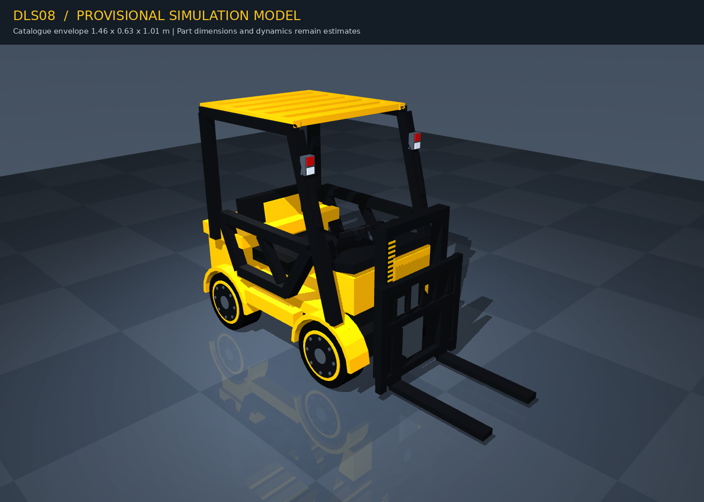

# 상품 기반 지게차 모델 검증

확인일: 2026-09-10. **기존 코어 64개 + 모델 시험 17개 = 81개 통과, 실패·skip 0개.** 잠정 모델의 형상·운동학·무부하 안정화·렌더링을 검증했다. 실물 사양 확정이나 자율 팔레트 작업 성공을 뜻하지 않는다.



## 근거와 실행 조건

[출처 기록](../references/dls08/README.md)의 상품 사진 및 제조사 카탈로그 PDF 12–13쪽을 직접 확인했다. 외형이 대응하는 DLS08 후보의 길이 1.46m·폭 0.63m·높이 1.01m·순중량 24kg을 사용했다. 실물 미보유 상태이며 휠베이스·부품 치수·조향·승강 범위·질량 분포·구동기는 추정/가정이다.

입력은 `synthetic` 관절 위치와 무부하 초기 상태이며 난수를 쓰지 않았다. Git 저장소가 정상 초기화되지 않은 작업공간이므로 revision 대신 소스 SHA-256과 YAML 스냅샷을 실행 산출물에 보관했다. Python 3.11.7, NumPy 2.4.6, MuJoCo 3.10.0, PyYAML 6.0.3, Pillow 12.2.0, pytest 9.1.0으로 실행했다. 개인 설치 경로·그래픽 장치 현황은 머신 환경 기록에서 관리한다.

```bash
FORKLIFT_RENDER_TEST=1 PYTHONDONTWRITEBYTECODE=1 \
  python -m pytest tests -q -p no:cacheprovider -W error
# 81 passed in 3.88s

ruff check --select E4,E7,E9,F,I,UP,B --target-version py310 \
  tools/build_forklift_model.py tools/forklift_model_geometry.py \
  tools/preview_forklift_model.py tests/simulation/test_forklift_model.py
ruff format --check --line-length 88 \
  tools/build_forklift_model.py tools/forklift_model_geometry.py \
  tools/preview_forklift_model.py tests/simulation/test_forklift_model.py
```

Ruff 0.16.6의 해당 네 파일 lint·format 검사가 통과했다. 기존 전체 코드의 Ruff 전환은 이 작업에 포함하지 않았다. 기존 코어 demo의 합성 JSON 출력도 정상이다. 선택 의존성 메타데이터를 포함한 wheel을 빌드하고 임시 환경에 설치하여 소스 트리 밖에서 import 및 demo 실행을 확인했다. 모델 도구·자원은 checkout에서 실행하며 wheel에 ROS 패키지로 설치되는 것은 아니다.

## 자동시험과 직접 확인

| 확인 항목 | 결과와 증거 범위 |
|---|---|
| 생성 XML 로딩 | MJCF와 URDF 모두 MuJoCo 컴파일 성공. URDF는 형상·관절 교환만 검증 |
| 전체 외형·질량 | 실제 컴파일된 시각 도형의 AABB가 1.46 × 0.63 × 1.01m, 질량 합 24kg |
| 설정 반영 | 전체 크기 변경, 앞/뒤 조향 축 변경이 컴파일된 형상과 관절 변환에 반영됨 |
| 승강 | +0.20m 명령 자세에서 두 포크 끝이 z로만 +0.20m 이동하고 중심 간격 0.29m 유지 |
| 포크 충돌 형상 | 두 갈래와 가운데 빈 공간을 ray 검사로 구분 |
| 설정 거부 | 오타·NaN·잘못된 포크 간격/조향 축·너무 넓은 마스트/큰 바퀴를 출력 전에 거부 |
| 관절 한계 | URDF의 N·m/N, rad/s/m/s를 구분하고 변경한 조향 토크가 MJCF에도 반영됨 |
| 시간 적분 | 바닥 장면에서 2ms × 1500 step = 3초. 경고 0, 접촉 8개, 차체 원점 z≈−0.0000765m, 최종 root 속도 norm≈7.71e−16 |
| 렌더링 | EGL 실제 렌더 성공. 최종 앞/뒤/측면/위/승강/조향 6개 자세를 직접 확인 |
| MP4 | H.264, 960 × 640, 24fps, 96프레임, 4초. 디코딩한 중간 프레임을 직접 확인 |

시각 확인에서 후면 그릴·지붕의 겹치는 면, 앞 기둥과 지붕 사이 틈, 기둥에 묻힌 램프를 수정했다. 사진과 주요 외형을 대조했지만 정밀 CAD 치수 일치 검사가 아니다.

## 교차검토와 수정

독립 Codex 검토에서 URDF와 MJCF의 충돌 계약 설명, 조향 effort 단위/수치, 변경된 부품의 전체 외형 범위 검증 누락이 지적됐다. 근거를 확인하고 반영했다. 관련 회귀시험 3개가 수정 전 실패하고 수정 후 통과했다. 최초 생성기와 렌더러도 각각 도구가 없는 상태의 실패를 확인한 뒤 구현했다.

추가로 URDF 속도 필드가 MJCF 서보 속도를 제한하지 않는다는 지적을 반영하여 이름을 `urdf_steering_speed_limit_radps`, `urdf_lift_speed_limit_mps`로 바꿨다. 이 값은 URDF 전용 메타데이터다. **두 형식의 물리 동등성은 주장하지 않는다.** MJCF는 자기 충돌 제외, URDF는 가져오는 엔진에서 별도 접촉·구동 설정이 필요하다.

## 재현 산출물과 남은 범위

최종 실행 디렉터리: `artifacts/20260910T073152Z_dls08_model_preview_01/`.

- [다각도 이미지](../../artifacts/20260910T073152Z_dls08_model_preview_01/views.png)
- [관절 자세 영상](../../artifacts/20260910T073152Z_dls08_model_preview_01/motion_preview.mp4)
- [렌더·입력 종류·모델 해시](../../artifacts/20260910T073152Z_dls08_model_preview_01/preview.json)
- [시험·안정화 수치·버전·소스 해시](../../artifacts/20260910T073152Z_dls08_model_preview_01/validation.json)
- [실행 파라미터 스냅샷](../../artifacts/20260910T073152Z_dls08_model_preview_01/parameters_snapshot.yaml)

원본과 영상은 Git 제외 영역이므로 checkout에 자동 포함되지 않는다. 대표 PNG는 이 문서의 `assets/`에 보관했다. 생성 명령은 [모델 README](../../sim/models/dls08_provisional/README.md)에 있다.

미검증: 실물 SKU·조향 기구·구동 성능, 적재·전복 한계, 실물/ROS 센서 입력, 팔레트 인식·포켓 추적, 주행 제어 및 A–D 작업 시나리오, ROS/Gazebo 로딩, native GUI 상호작용. MP4는 운동학 자세 미리보기이며 시간 적분 주행 영상이 아니다. ROS 설치·전체 환경 구성·코어 구조 전환·발표 수정·커밋·push는 수행하지 않았다.
