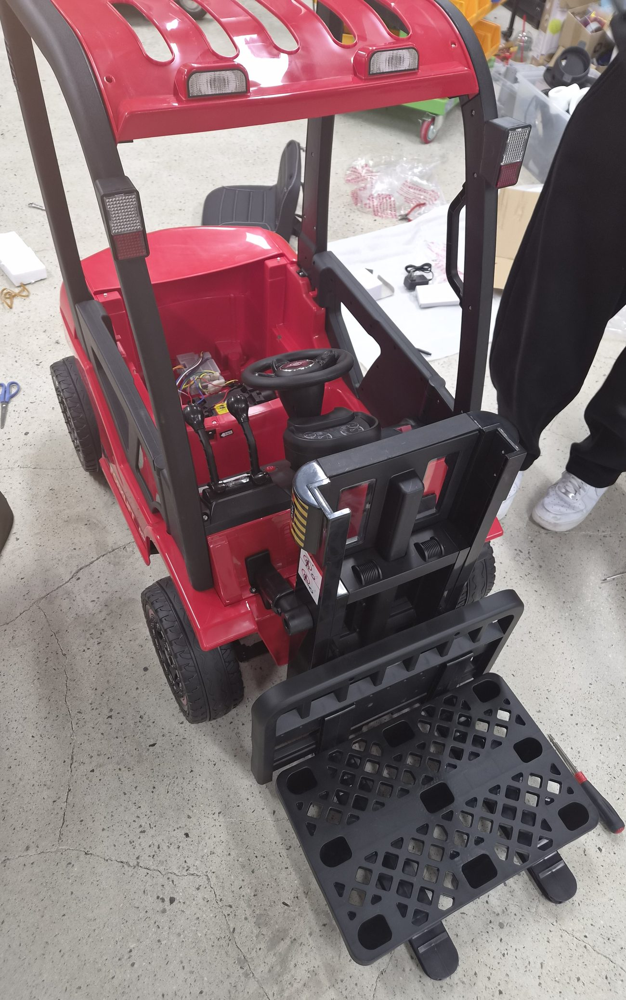
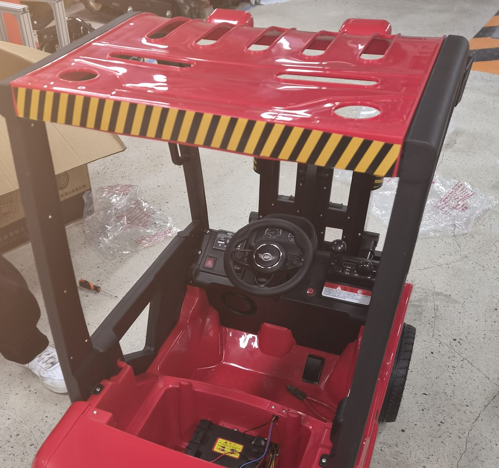
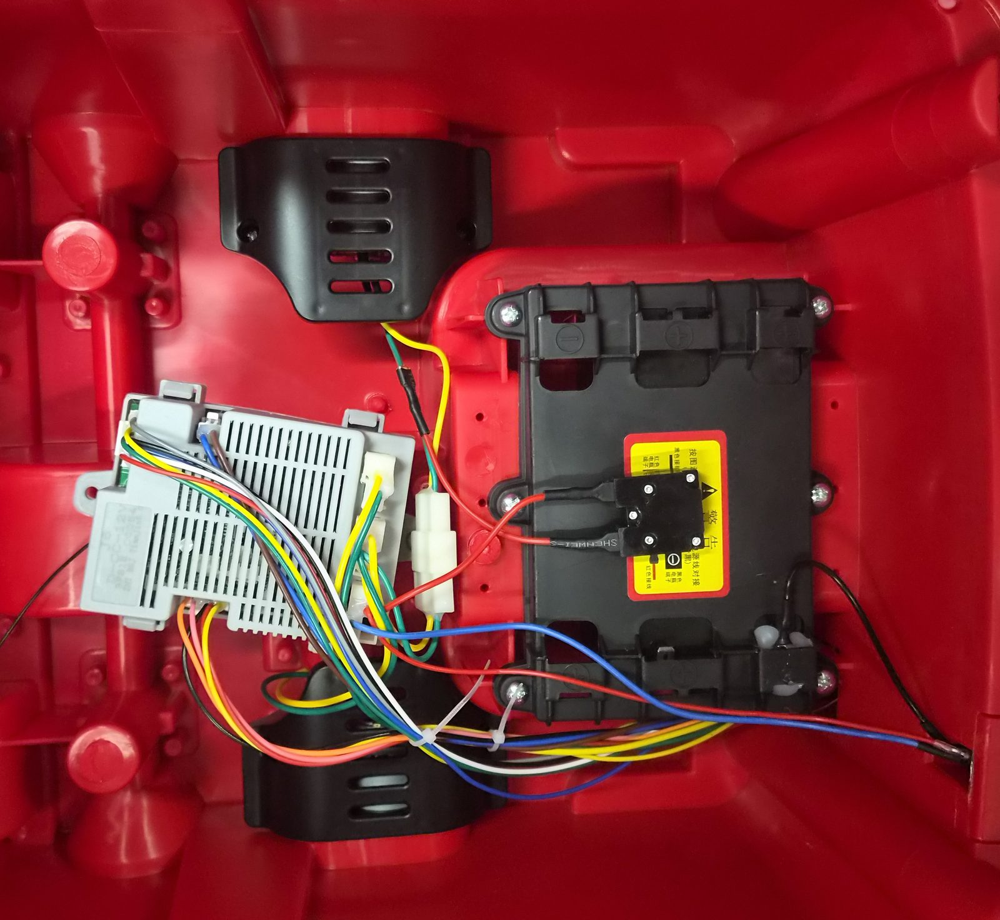
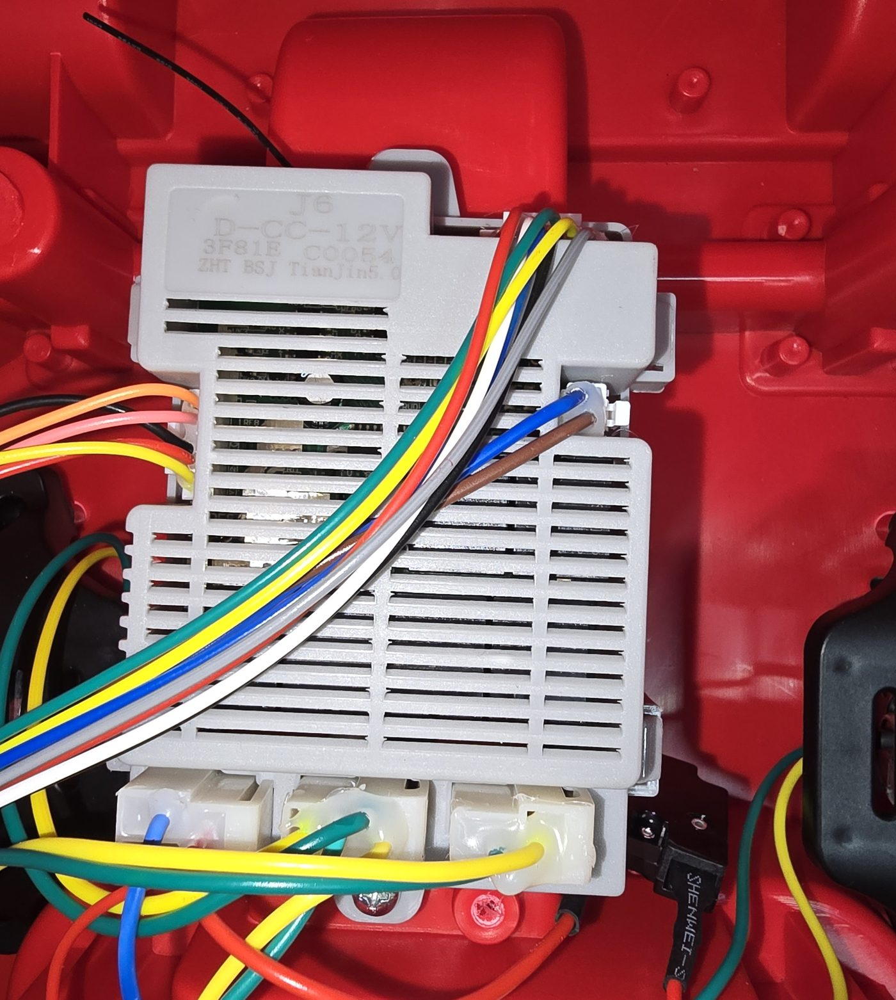
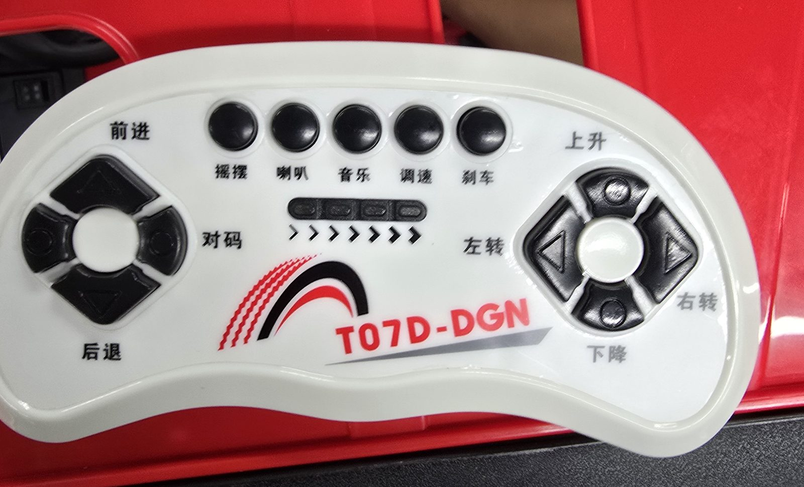
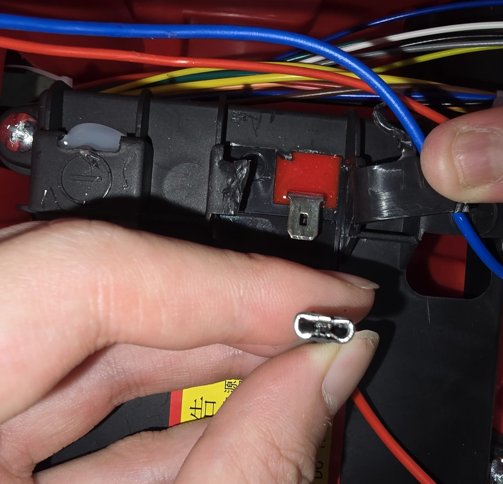

# 차체 입고와 초기 구조 조사 (H0/H1 착수)

확인일: 2026-09-23. 범위: **로드맵 [H0 입고 조사](../plans/2026-09-11-development-roadmap.md)의 착수 기록**이다.
H0 완료 기록이 아니다 — H0 이 요구하는 측정표·기구도가 없고, H1 이 요구하는 배선도·부품표·정격 근거도 없다.

이 기록의 근거는 **2026-09-23 새벽에 촬영한 사진 10장과 판매 페이지 캡처 1장뿐이다.**
자·캘리퍼를 댄 측정, 통전 시험, 분해 계측, 주행은 하지 않았다. 따라서 아래 "확인한 것"은
전부 **육안 관찰과 부품 표기 판독**이며, 치수·정격·성능은 하나도 포함하지 않는다.

## 1. 입고 구성

| 항목 | 상태 |
|---|---|
| 차체 | 승용 완구형 지게차 1대. **팀이 조립하였다** |
| 무선 조종기 | 1개 (`T07D-DGN` 표기) |
| 충전기 | 1개 (사진 배경에 확인) |
| **팔레트** | 흑색 사출 플라스틱 팔레트 **1장이 동봉**되어 있었다 |

동봉 팔레트는 예상하지 못한 구성품이다. [ADR 0002](../decisions/0002-test-pallet-and-geometry-generality.md)가
정한 시험 형상(EPAL 6 과 T11 ×0.6)을 **대체하지 않는다.** 치수를 재기 전에는 어느 규격과도 대응시키지 않는다.

## 2. 확인한 것 — 육안 관찰과 표기 판독

### 2.1 외형과 기구



- 오버헤드 가드(운전석 위 보호 지붕), 시트, 운전대를 갖춘 **승용형 배치**다.
- 차륜 **4개**. 전면 범퍼에 `DLS` 와 `FORKLIFT` 각인이 있다.
- 마스트(포크를 올리는 수직 구조물)와 포크 캐리지, **포크 2개**가 달려 있다.
- 동봉 팔레트는 격자 개구가 있는 사출 성형품이고 아래쪽에 다리 형태의 받침이 있다.

⚠️ **마스트 단수, 승강 전달 방식, 구동축·조향축이 각각 어느 축인지는 사진으로 판정하지 않았다.**

### 2.2 조작부



운전대, 콘솔의 **레버 2개**, 적색 로커 스위치, 전원 버튼, 경고 라벨이 있다.
레버의 기능(승강·전후진·변속 중 무엇인지)은 **조작해 확인하지 않았다.**

### 2.3 전장 배치



좌석 아래 공간에 제어기 모듈과 배터리가 나란히 고정되어 있고, 백색 커넥터로 하네스가 연결된다.
하네스는 색으로 구분된 여러 가닥이다. **가닥 수를 정확히 세지 않았고 각 심선의 종단도 추적하지 않았다** — 사진으로는 커넥터 뒤쪽이 보이지 않는다.

### 2.4 제어기 표기



라벨을 그대로 옮기면 다음과 같다.

```
J6
D-CC-12V
3F81E  C0054
ZHT BSJ TianJin5.0
```

백색 커넥터 **3개**가 하단에 있고, 상단·좌측으로 하네스가 나간다.

### 2.5 무선 조종기 표기



`T07D-DGN` 표기. 버튼 각인을 그대로 옮기면 다음과 같다.

| 각인 | 뜻 |
|---|---|
| 前进 / 后退 | 전진 / 후진 |
| 上升 / 下降 | 상승 / 하강 |
| 左转 / 右转 | 좌회전 / 우회전 |
| 调速 | 속도 조절 |
| 刹车 | 제동 |
| 摇摆 | 흔들기 |
| 喇叭 / 音乐 | 경적 / 음악 |
| 对码 | 짝짓기(페어링) |

즉 **주행·조향·승강 세 축이 모두 무선 조종기의 입력으로 제어된다.**

### 2.6 배터리



`SHENWEI` 표기, 12V 표기 경고 라벨, 스페이드 단자, 브래킷 고정.
**용량(Ah), 화학 조성, 실제 단자 전압은 측정하지 않았다.**

### 2.7 같은 모델명의 판매 페이지

`J6D-CC-12V` 제어기와 `T07D-DGN` 조종기를 세트로 파는 상거래 페이지를 찾았다(2026-09-23 확인).
**이 페이지는 부품 식별의 방증일 뿐 핀맵·통신 규약·펌웨어를 확정하지 않는다.**
해당 페이지의 설명문에는 AI 가 생성했다고 표시된 요약이 포함되어 있어 사양 근거로 쓰지 않는다.
또한 차체 라벨은 `J6` 와 `D-CC-12V` 가 줄바꿈으로 분리되어 있고 판매 페이지는 `J6D-CC-12V` 로 붙여 쓴다 —
**같은 부품인지는 표기 유사성만으로 확정하지 않는다.**

## 3. 확인하지 않은 것

발표와 이후 설계에서 **이 항목들을 확인된 것처럼 쓰지 않는다.**

| 구분 | 미확인 항목 |
|---|---|
| 치수 | 전장·전폭·전고, 축간거리, 윤거, 포크 길이·폭·두께·간격, 포크 최저/최고 높이, 마스트 높이, 최소 회전 반경 |
| 질량·하중 | 차체 무게, 적재 한도, 무게 중심 |
| 기구 | 구동축과 조향축의 배정, 조향 방식(애커먼 여부), 마스트 단수, 승강 전달 방식 |
| 전장 | 모터 정격·전류, 배터리 용량, 퓨즈·차단 구성, 하네스 각 심선의 종단 |
| 제어 | 제어기 핀맵·통신 규약·펌웨어, 조종기 무선 규격과 채널 |
| **상태 취득** | 속도·조향각·승강 위치를 **외부에서 읽을 수 있는 경로가 있는지** |
| **내부 센서** | 액추에이터 내부 홀 센서·포텐셔미터, 승강 끝단 리미트 스위치, 제어기 내부 전류 검출의 **존재 여부** |
| 대응 | `sim/models/dls08_provisional/` 와의 SKU 동일성 |
| 팔레트 | 동봉 팔레트의 외형 치수와 개구 치수 |

⚠️ **"상태 취득 경로"와 "내부 센서"는 서로 다른 항목이다.** 내부 센서가 있어도 외부로 신호가
나오지 않을 수 있고, 외부 신호가 없다고 해서 내부 센서가 없는 것도 아니다. 사진으로는 둘 다 판정할 수 없다.

## 4. 잠정 모델과의 관계

`sim/models/dls08_provisional/` 은 상품 사진·카탈로그에서 외형이 대응하는 후보를 모델링한 것이고,
전체 크기 1.46 × 0.63 × 1.01 m 와 순중량 24 kg 은 **카탈로그 값**이다
([모델 기록](../../sim/models/dls08_provisional/README.md)).

이번 입고로 확인된 것은 **차체 전면에 `DLS` 각인이 있다는 사실 하나**다.
SKU 동일성도, 카탈로그 치수의 타당성도 확인되지 않았다. 잠정 모델의 숫자는 **여전히 카탈로그 값**이며
실측으로 승격하지 않는다.

## 5. 원본 사진

원본은 저장소 밖에 둔다([CONTRIBUTING §8](../../CONTRIBUTING.md)). 아래는 원본의 SHA-256 이다.
저장소에 넣은 사본은 **EXIF 를 제거하고 축소·크롭한 공개용**이며, 원본과 화소가 같지 않다.

| 원본 파일 | SHA-256 | 저장소 사본 |
|---|---|---|
| `20260923_000506.jpg` | `badb23dddee10c2620f3dcdfe20ab1b3f6dacdb186a5aa6909f523b009f08f5b` | `05_remote.jpg` |
| `20260923_000943.jpg` | `28a464d7728d68f4530ab51c1f73c437b2c76fe210d1422f35bcb3e6786b679b` | — |
| `20260923_000949.jpg` | `e1423c5ce7a754706c4cfcbd94d7d7b379718e243c4b1eb8630df7f02f54c556` | `06_battery_terminal.jpg` |
| `20260923_002929.jpg` | `ab4868b9e4292be5eda64709fa3c26f91de469a74ba76ff9381e7a31d68c9652` | `04_controller.jpg` |
| `20260923_002932.jpg` | `74e05e003ba2189b2c6c01e778dc9aa5eed8e1a785b0252719b9e28fd0597651` | — |
| `KakaoTalk_20260923_011117564_01.jpg` | `b6116f0cac11679a37ed42dc9347467a4eeb97baf7b96c94dee78cec11dd091f` | `02_cockpit_battery_bay.jpg` |
| `KakaoTalk_20260923_011117564_02.jpg` | `2f8ed821b907e3ed24f7859c08679b50b50902b1221ff11f07d6fea86f828b90` | `01_chassis_and_pallet.jpg` |
| `KakaoTalk_20260923_011117564_03.jpg` | `0981a7e4602cf664b23c4fccf68d3b44f3ad13a14a413702fd432e1558c59352` | — |
| `KakaoTalk_20260923_011117564_04.jpg` | `941a2b12311251b80312108680c4da4c74631c9c232e9da13be61b9b346e01c2` | — (초점 불량) |
| `KakaoTalk_20260923_011117564_05.jpg` | `e9ac84576fa6e8f543367ad15f7e71a427900563891b0175d5583d32c61dbe3d` | `03_electronics_bay.jpg` |
| `KakaoTalk_20260923_011041931.png` | `53f83d6be3452578fc63ca08102ef5764f6685766169dd5af9cb7931fde5de71` | — (판매 페이지 캡처, 비공개) |

**공개 전 처리.** 원본 11장 중 **9장에 위도·경도 EXIF 태그가 있었다.** 저장소 사본은 화소 데이터만
새 컨테이너에 옮겨 담아 메타데이터를 전부 제거했고(태그 0개 확인), 다른 팀의 장비가 찍힌 배경은
잘라냈다. 원본은 EXIF 방향 태그가 6 또는 8 이므로 회전을 적용하지 않고 자르면 좌표가 어긋난다.

## 6. 다음 조사 항목

발표에서 카메라 장착을 다루려면 아래 ①~④ 가 먼저 필요하다. 그 밖은 H0/H1 잔여 항목이다.

1. 후보 카메라 장착점의 기준 좌표와 기울기.
2. 포크 끝과 포켓의 상대 위치.
3. 카메라를 다는 자리가 **고정 마스트인지 승강하는 캐리지인지** — 후자면 승강 위치에 따라
   좌표 변환을 갱신해야 한다([로드맵 H0 센서 배치 검토](../plans/2026-09-11-development-roadmap.md)).
4. 브래킷 공간과 케이블 경로, 마지막 접근 구간에서 포크·팔레트가 카메라를 가리는지.
5. (H0) §3 의 치수·질량 항목 실측과 기구도.
6. (H1) 하네스 심선 추적, 모터·배터리 정격, 물리 비상정지 경로.
7. (H1) 속도·조향·승강 상태를 외부에서 읽을 수 있는지, 없으면 무엇을 덧붙여야 하는지.
8. 동봉 팔레트의 외형·개구 치수 측정과 ADR 0002 형상들과의 대조.
