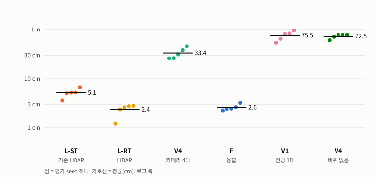
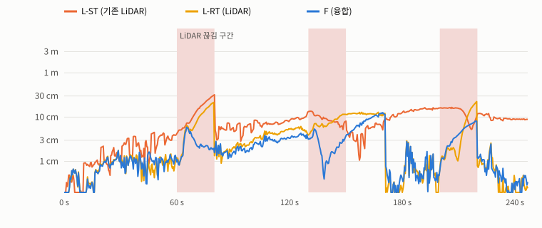
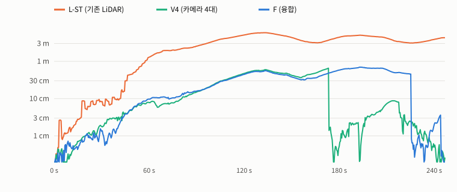
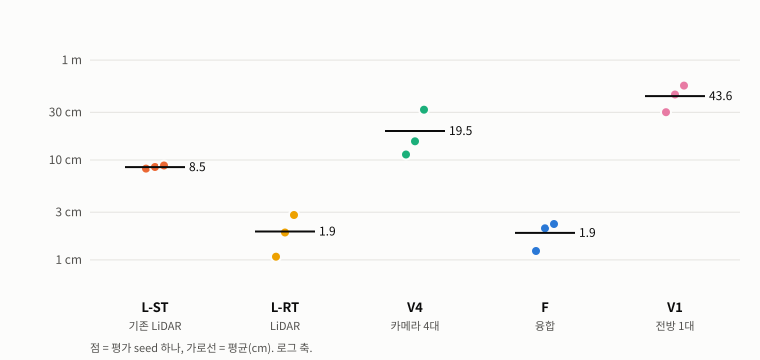
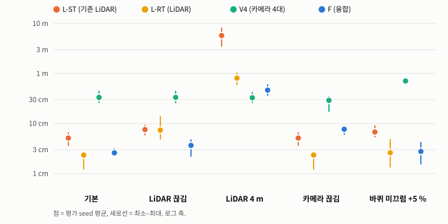
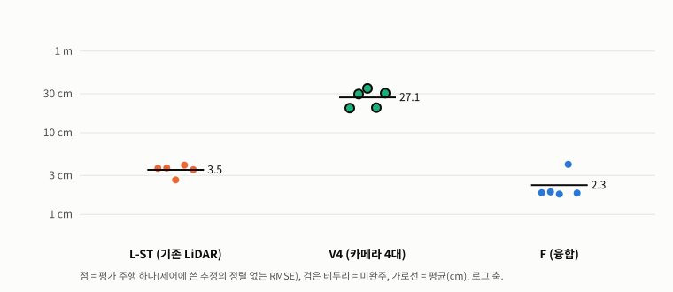

# 주변 RGB-D 4대 Vision SLAM 과 LiDAR SLAM 비교·융합 — 실행 기록

계획: [2026-10-07 계획 v2](../plans/2026-10-07-visual-slam-and-fusion.md). 이 기록은 그 계획의 R0–D 단계에 대한 실제 결과다.

## 범위

입력은 전부 `synthetic` 이다. 검증 종류는 센서 렌더(Isaac RGB·깊이), PhysX 광선 투사 2D 스캔, 물리 주행(Isaac PhysX), 오프라인 재생(기록 → 브리지 →
RTAB-Map/slam_toolbox), 온라인 폐루프(SLAM 추정으로 주행)다. 카메라 4 대는 **시뮬레이션 가정**이다 — 실물로 확정된 카메라는 D435i 1 대뿐이고 장착은 미정이다
([hardware](../hardware.md)). 차체는 기존 SLAM 기록과 같은 `dls08_provisional`, 장면은 `south_hall_v2` 공장 홀, 경로는 116 m 조사 루프다.

결론은 §9 에 있다. 아래 수치는 모두 이 합성 조건의 값이며 실물 센서 성능이 아니다.

## 1. 환경

- ws1, NVIDIA GeForce RTX 5070 Ti, driver 580.178.04, Slurm `compute`(`admin` QOS), Isaac Sim 5.1(`/opt/isaacsim-env`), 실험 디렉터리
  `/home/projects/forklift/artifacts/20261007T_visual_slam/`(이하 `EXP`, `source/` 스냅숏·`env/`·`records/`·`replays/`·`online/`·`videos/`).
- ROS 2: `forklift/ros2-dev:jazzy-vslam`(`deploy/ros2_vslam/Dockerfile`, 기존 `forklift/ros2-dev:jazzy` 위에 RTAB-Map 만 추가, 이미지 `sha256:b925c571…`).
  RTAB-Map 0.23.13(`ros-jazzy-rtabmap-slam/odom 0.23.13-1noble.20261003`), slam_toolbox 2.8.5(`2.8.5-1noble.20260905.070219` — 9/26·10/04 기록과 같은 바이너리).
- 2026-10-08 00:23–00:50 KST ws1 노드가 관리자 GPU 유지보수(`GPU1 VFIO passthrough teardown`)로 drain 되었다. 그동안과 그 뒤의 **오프라인 재생은 같은
  `deploy/slurm/vslam_replay.sbatch` 를 Slurm 밖에서 컨테이너당 2 코어로** 돌렸다(동시 4 개). Isaac 기록·온라인 폐루프는 모두 Slurm 작업이다.

## 2. 카메라 리그와 기록 (R0·R1)

`config/isaac_depth_rig.yaml` — 640 × 480, fx = fy = 465.74 px(수평 69.0°), z-깊이 0.28–8.0 m, 지붕(z 1.03 m) 위 전·후·좌·우, 15° 아래.
매 LiDAR 스캔(10 Hz)과 같은 물리 스텝에서 **물리를 멈추고 8 번 렌더한 뒤** 4 대를 읽는다(`sim/isaac/depth_rig.py`).

**신선도 검사.** 20 프레임마다 카메라마다 16 × 12 화소에 PhysX 광선을 쏴서 렌더 깊이와 비교한다 — 지금 자세의 중앙 잔차 ≤ 5 mm, 그리고 1·3·12 물리 스텝
전 자세와 깊이가 5 mm 넘게 달라지는 화소에서 렌더가 지금 자세에 더 가까워야 한다. 평평한 바닥은 평행 이동해도 깊이가 같아서 단순 중앙값으로는 지연을 가를
수 없다(R0 첫 판정에서 실제로 그랬다). 판정이 가능한 검사에서 물리 1 스텝(8.3 ms) 지연도 갈렸다 — 예: R0 의 왼쪽 카메라, 지금 자세 잔차 0.5 µm 대 1 스텝 전
9.0 mm.

**결함 하나를 이 검사가 잡았다 — 근거리 클리핑 1 m.** 첫 기록 `nominal_seed0`(결함판)에서 492 회 중 3 회가 실패했다(지금 자세 잔차 0.27–0.75 m, 지연
자세도 같은 크기 — 지연이 아니라 형상 차이). 측면 카메라가 상자 더미에서 약 0.3 m 떨어져 지날 때 렌더 깊이가 1.003 m 아래로 내려가지 않았고(유효 화소
1 백분위), 화면에는 상자 **안쪽**이 보였다. USD 카메라의 기본 클리핑이 `[1.0, 1e6] m` 였다(실행 중 되읽음). 인식 카메라는 `[0.03, 100]` 을 지정하지만
리그는 지정하지 않았다. `[0.05, 100] m` 로 명시하고 실행 중 되읽어 확인하게 고친 뒤 10 개 기록을 모두 다시 했다. 결함판은 `EXP/defective_near_clip/` 에 두었다.
`run_slam_drive.py --robot-camera`(9/26 기록의 영상 전용 전방 카메라)도 클리핑을 지정하지 않는다(코드 확인, 실행 중 값은 읽지 않음) — 표시용이라 이번에 고치지 않았다.

**기록(모두 `success: true`, 신선도 실패 0, 자기 차체 적중 0).**

| 기록 | 속도 | 경로 | 스캔(= 리그 프레임) | 판정 가능 신선도 검사 | 지금 자세 잔차 최대 | 도착 오차 | 벽시계 |
|---|---|---:|---:|---|---:|---:|---:|
| nominal_seed0 (개발) | 0.5 m/s | 115.6 m | 2,453 | 469/469 | 6.3 µm | 6.3 mm | 715 s |
| nominal_seed1 | 0.5 | 115.9 | 2,469 | 473/473 | 6.3 µm | 6.2 | 730 |
| nominal_seed2 | 0.5 | 115.9 | 2,469 | 472/472 | 6.3 µm | 6.2 | 737 |
| nominal_seed3 | 0.5 | 114.9 | 2,454 | 470/470 | 6.4 µm | 6.1 | 744 |
| nominal_seed4 | 0.5 | 115.9 | 2,469 | 466/466 | 6.3 µm | 6.2 | 752 |
| nominal_seed5 | 0.5 | 115.1 | 2,451 | 469/469 | 6.3 µm | 6.3 | 1,491 |
| fast_seed0 (개발) | 1.0 | 115.6 | 1,353 | 260/260 | 6.1 µm | 14.1 | 703 |
| fast_seed1 | 1.0 | 115.9 | 1,366 | 261/261 | 6.3 µm | 13.6 | 780 |
| fast_seed2 | 1.0 | 115.9 | 1,366 | 261/261 | 6.5 µm | 13.6 | 772 |
| fast_seed3 | 1.0 | 114.9 | 1,362 | 254/254 | 6.3 µm | 13.9 | 770 |

nominal_seed5 의 벽시계가 두 배인 것은 이 기록이 다른 GPU 작업과 같은 노드에서 겹쳐 돌았기 때문이다(Slurm 기록).

경로 표시선(계획 경로를 바닥에 그리는 시각화)은 리그 기록에서 끈다 — R0 영상에서 로봇 카메라에 그대로 보였다(실제 트럭에는 없는 시각 특징).
기록 하나는 약 1 GB(JPEG RGB + 16 bit PNG 깊이 × 4 대 × 약 2,450 프레임)다.

## 3. 비교한 구성

모든 RTAB-Map 구성은 같은 브리지(`forklift_ros.rig_slam_bridge`)와 같은 뒷단 설정(`ros2/src/forklift_bringup/config/rtabmap_rig.yaml`)을 쓰고, **앞단 증분
융합기(`forklift_core.localization.odometry_fusion`)에 넣는 센서만 다르다.** 설계가 v1 에서 바뀐 이유와 개발 seed 0 의 근거는 계획 v2 개정 표에 있다.

| 이름 | 센서 | 앞단 | 뒷단(루프 폐쇄) |
|---|---|---|---|
| **L-ST** (기존) | LiDAR + 바퀴 | 바퀴 오도메트리 | slam_toolbox 2.8.5 (9/26 재생 설정 그대로) |
| L-RT | LiDAR + 바퀴 | 바퀴 ⊕ ICP 오도메트리 | RTAB-Map, ICP 근접 정합 |
| V1 | 전방 카메라 1 대 + 바퀴 | 바퀴 ⊕ 시각 오도메트리 | RTAB-Map, 시각 근접 정합 |
| **V4** (Vision SLAM) | 카메라 4 대 + 바퀴 | 바퀴 ⊕ 시각 오도메트리(4 대) | RTAB-Map, 시각 근접 정합 |
| V4-noodom | 카메라 4 대 | 시각 오도메트리만 | RTAB-Map, 시각 근접 정합 |
| **F** (융합) | 카메라 4 대 + LiDAR + 바퀴 | 바퀴 ⊕ 시각 ⊕ ICP | RTAB-Map, 시각 + ICP 근접 정합 |

⊕ 는 프레임 간 이동량의 불확실성 가중 평균이다. 각 앞단은 바퀴를 예측값으로 쓰고, lost 이거나 센서가 아무것도 내지 않은 프레임에는 빠진다.
외형 기반 전역 루프 폐쇄는 모든 구성에서 껐다 — 개발 seed 0 에서 같은 상자 더미 통로를 13.4 m·6.6 m 떨어진 곳과 같은 장소로 판정했다(§5).

## 4. 지표와 판정

- **오프라인(같은 기록을 각 구성에 재생):** 프레임마다 그 순간의 **온라인 추정**(사후 재최적화 아님)을 참 출발 자세에 맞춰 놓고 정답과 비교한
  **시작 정렬 ATE**(RMSE, 주 지표) — 로봇이 아는 유일한 정렬이다. 최소자승 정렬 ATE·최대·최종 오차와 같은 프레임의 바퀴 오도메트리 값을 함께 남긴다
  (`tools/evaluate_rig_slam.py`, `tools/summarise_rig_slam.py`). 잡음: LiDAR 거리 σ 0.02 m·뒷바퀴 σ 0.2 rad/s·조향 σ 0.005 rad(9/26 가정) +
  깊이 σ = 0.0036·z² m, 잡음 seed = 기록 seed.
- **온라인(그 추정으로 실제 주행):** 10/04 S1 과 같은 정의 — 제어에 실제로 쓴 뒷차축 추정과 정답의 **정렬 없는** RMSE·최대, 완주 여부, 정답 도착 오차
  (`tools/summarise_rig_online.py`).
- **사전 등록:** 개발 seed 0 에서만 조정하고 계획 v2 의 해시로 동결했다. 평가 seed 1–5(고속 1–3)는 동결 뒤 한 번씩만 돌렸고, 평균·비율에는 seed 0 을 넣지
  않는다. seed 5 개라 통계적 유의성은 주장하지 않는다 — seed 별 값과 "나은 seed 수" 를 함께 적는다.

## 5. 개발 기록(seed 0)에서 확인한 것

평가 seed 를 돌리기 전, 개발 기록 하나로 확인하고 설계에 반영한 사실이다(계획 v2 개정 표). 평가 결과를 읽을 때 필요하다.

1. **창고는 시각 장소 인식에 불리하다.** 같은 크기·같은 상자 무늬의 적재 더미가 줄지어 있어서, RTAB-Map 의 외형(BoW) 루프 폐쇄가 t = 150.7 s 의 로봇
   (−5.0, −6.6)을 t = 23.4 s 의 노드(−16.6, 0.0)와 같은 장소로 판정했다 — 실제로 13.4 m, 방향은 같다. 받아들여진 이 폐쇄로 추정이 14 m 순간이동했고 V4 의
   ATE 는 7.1 m 였다. 융합 구성도 6.6 m 떨어진 노드와 오매칭했다. `RGBD/OptimizeMaxError`(그래프 오차 비율 검사)는 일부만 걸렀고, `RGBD/MaxLoopClosureDistance`
   는 두 노드 사이 정합 변환의 길이만 봐서(오매칭은 정합상 ~0 m) 걸러내지 못했다. 그래서 모든 구성에서 **현재 추정 2 m 안의 근접 탐색만** 루프 폐쇄로 쓴다.
   이 방식은 오도메트리 표류가 2 m 를 넘지 않는다는 전제에 기댄다.
2. **4 대의 이점은 역방향 재방문에서 나온다.** t = 220.7 s 의 로봇은 t = 27.9 s 의 노드와 0.50 m 거리에서 방향이 164° 달랐는데도 정합되었다 — 후방 카메라가
   예전 전방 카메라의 장면을 본다. 같은 설정의 전방 1 대(V1)는 근접 링크를 **하나도** 만들지 못했다(V4 는 36 개).
3. **이 시뮬레이션의 시각 오도메트리는 바퀴보다 직선에서 약하고 회전에서 강하다.** 루프 폐쇄 없이 시작 정렬 ATE 는 V4 1.10 m(합성 잡음)·1.08 m(잡음 없음),
   바퀴만 0.63·0.55 m. 회전량 비(추정/정답)는 시각 좌회전 0.9994·우회전 1.006, 바퀴 1.021·1.076. 미끄럼 없는 시뮬레이션 바퀴가 직선에서 매우 정확하기 때문이며,
   잡음 유무가 결과를 거의 바꾸지 않아 주된 오차는 깊이 잡음이 아니라 3D-3D 정합 자체의 진행 방향 흔들림이다(다중 카메라 PnP 불가, 계획 v2 #3).
4. **직렬 융합(VO 를 ICP 의 예측값으로)은 LiDAR 단독보다 나빴다** — F 0.171 m 대 L-RT 0.025 m. 직선 통로에서 ICP 는 진행 방향으로 퇴화(평행한 벽·더미)하여
   예측값을 그대로 따르는데, 그 예측값이 위의 흔들리는 VO 였다. 각 원천의 증분을 불확실성으로 가중 평균하는 방식으로 바꾸자 F 0.021 m(L-RT 0.028 m).
5. **20 s 센서 끊김 뒤 오도메트리가 영영 lost** 였다(`Odom/ResetCountdown 0`, 최대 500 프레임 연속). 1 로 바꿔 끊김 직후 1 프레임에 복구된다.

## 6. 오프라인 결과 — 기본 조건

같은 기록을 각 구성에 재생했다. 값은 **시작 정렬 ATE(cm)**, 합성 잡음, 116 m 조사 루프. 마지막 열은 같은 재생에 들어간 바퀴 오도메트리만의 값이다.
평균에는 개발 seed 0 을 넣지 않았다.

<!-- TABLE:nominal -->
| 기록 | L-ST | L-RT | V1 | V4 | V4-noodom | F | 바퀴만 |
|---|---|---|---|---|---|---|---|
| seed0 (개발) | 7.5 | 2.8 | 58.9 | 40.1 | 72.1 | 2.1 | 63.0 |
| seed1 | 5.0 | 1.2 | 80.9 | 26.2 | 77.5 | 2.3 | 76.3 |
| seed2 | 5.2 | 2.8 | 64.8 | 31.3 | 76.8 | 2.5 | 83.4 |
| seed3 | 5.2 | 2.8 | 95.6 | 45.5 | 71.2 | 2.6 | 96.5 |
| seed4 | 3.6 | 2.4 | 82.7 | 26.0 | 60.5 | 2.4 | 82.1 |
| seed5 | 6.7 | 2.6 | 53.9 | 38.3 | 76.7 | 3.2 | 66.5 |
| **평가 평균** | **5.1** | **2.4** | **75.5** | **33.4** | **72.5** | **2.6** | |
<!-- /TABLE -->

- **카메라 4 대 Vision SLAM(V4)은 기존 LiDAR SLAM 보다 6.6 배 부정확하다** — 33.4 cm 대 5.1 cm, 5/5 seed. 전방 1 대(V1)는 75.5 cm 로 바퀴만(평균 81.0 cm)과
  비슷하고, 바퀴 없이 카메라만(V4-noodom)이면 72.5 cm 다. 4 대가 1 대의 절반 이하인 것은 역방향 재방문의 근접 루프 덕분이다(§5-2).
- **융합(F)은 기존 대비 오차를 48 % 줄였다**(5.1 → 2.6 cm, 비율 0.52, 5/5 seed). 그러나 **같은 뒷단의 LiDAR 단독(L-RT) 2.4 cm 와 같은 수준**이다
  (F/L-RT 1.19, 나은 seed 2/5). 이 조건에서 기존 대비 개선은 카메라가 아니라 LiDAR 처리 방식 — RTAB-Map 의 ICP 오도메트리와 근접 루프 — 에서 온다
  (L-RT/L-ST 0.47).

잡음 없는 기준(같은 기록, 잡음만 끔):

<!-- TABLE:clean -->
| 기록 | L-ST | V4 | F | 바퀴만 |
|---|---|---|---|---|
| seed0 (개발) | 3.2 | 31.0 | 0.8 | 55.0 |
| seed1 | 3.4 | 17.2 | 0.8 | 81.0 |
| seed2 | 3.7 | 18.8 | 0.8 | 81.0 |
| seed3 | 3.6 | 34.2 | 1.1 | 100.1 |
| seed4 | 3.3 | 15.3 | 0.9 | 81.0 |
| seed5 | 3.1 | 25.3 | 0.9 | 61.5 |
| **평가 평균** | **3.4** | **22.2** | **0.9** | |
<!-- /TABLE -->

잡음이 없으면 F 0.9 cm·L-ST 3.4 cm·V4 22.2 cm. 순서는 같고, F/L-ST 비율은 0.26 이 된다(잡음이 F 쪽 이득을 줄인다).

## 7. 오프라인 결과 — 악조건

기록은 그대로 두고 재생할 때 열화를 넣었다(`forklift_core.localization.sensor_conditions`). L-ST 는 스캔이 없는 프레임(LiDAR 끊김)에 마지막 map←odom
보정을 바퀴 오도메트리에 실어 평가했다 — 로봇의 TF 사슬이 그 순간 쓰는 값이다(처음 집계는 이 프레임을 빼서 L-ST 에 유리했다; §7.1).

### 7.1 LiDAR 끊김 (60–80 s, 130–150 s, 200–220 s)

<!-- TABLE:lidar_blackout -->
| 기록 | L-ST | L-RT | V4 | F | 바퀴만 |
|---|---|---|---|---|---|
| seed0 (개발) | 8.8 | 6.5 | 40.1 | 2.9 | 63.0 |
| seed1 | 9.6 | 6.1 | 26.2 | 3.4 | 76.3 |
| seed2 | 6.5 | 4.8 | 31.3 | 3.3 | 83.4 |
| seed3 | 5.8 | 14.0 | 45.5 | 4.6 | 96.5 |
| seed4 | 7.5 | 5.0 | 25.7 | 2.2 | 82.1 |
| seed5 | 8.6 | 7.0 | 38.6 | 4.8 | 66.5 |
| **평가 평균** | **7.6** | **7.4** | **33.4** | **3.7** | |
<!-- /TABLE -->

L-ST 는 끊긴 20 s 를 바퀴로 버틴 뒤 스캔 정합으로 돌아와 평균 7.6 cm(끊긴 구간 포함, 평가 seed 의 최대 0.25–0.32 m)였다. L-RT 도 바퀴만 남아 7.4 cm.
**F 는 카메라가 끊긴 동안을 이어 받아 3.7 cm** — L-RT 대비 0.54 배(5/5), L-ST 대비 0.50 배(5/5). 카메라가 LiDAR 고장을 메우는 효과가 가장 깨끗하게
보이는 조건이다. 처음 집계는 스캔이 없는 600 프레임을 L-ST 평가에서 빼서 L-ST 에 유리했다(seed 1·2·3 이 7.9·4.0·3.8 cm, 고친 뒤 9.6·6.5·5.8 cm) —
평가 도구가 마지막 보정을 바퀴에 실어 그 프레임을 채우도록 고친 값이 위 표다(`tools/evaluate_rig_slam.py` `hold_correction`, 시험 추가).

### 7.2 LiDAR 측정 거리 4 m

<!-- TABLE:lidar_short -->
| 기록 | L-ST | L-RT | V4 | F | 바퀴만 |
|---|---|---|---|---|---|
| seed0 (개발) | 809.1 | 83.9 | 39.8 | 46.0 | 63.0 |
| seed1 | 347.3 | 105.1 | 26.2 | 36.0 | 76.3 |
| seed2 | 469.9 | 93.3 | 31.3 | 40.9 | 83.4 |
| seed3 | 603.6 | 91.4 | 43.0 | 48.1 | 96.5 |
| seed4 | 623.9 | 58.0 | 25.7 | 61.4 | 82.1 |
| seed5 | 833.4 | 58.1 | 38.3 | 47.2 | 66.5 |
| **평가 평균** | **575.6** | **81.2** | **32.9** | **46.7** | |
<!-- /TABLE -->

홀이 30 × 31 m 라 4 m 안에 기댈 구조물이 없는 구간이 생긴다. **기존 L-ST 는 3.5–8.3 m 로 무너졌고**(지도 자체가 어긋남), L-RT 도 0.58–1.05 m.
카메라를 쓰는 V4 는 영향이 없다(32.9 cm). **F 는 46.7 cm — L-ST 대비 0.09 배(오차 91 % 감소), L-RT 대비 0.64 배(4/5)** 로 크게 낫지만, **카메라만 쓴
V4 보다는 1.48 배 나쁘다(0/5).** 원인 둘: ① 앞단 융합이 고정 불확실성을 써서, 거리 제한으로 부정확해진 ICP 를 여전히 정밀하다고 믿는다 ② F 의 뒷단은
루프 정합에 시각+ICP 를 함께 쓰는데 짧은 스캔에서 ICP 단계가 실패해 근접 링크가 seed 1·2·3 에서 77·70·56 개 → 6·5·9 개로 줄었다(같은 조건의 V4 는
34·36·22 개). 아래 그림에서 V4(초록)는 180 s 무렵 근접 루프로 2 cm 로 돌아오지만 F(파랑)는 그 보정을 받지 못한다.

### 7.3 카메라 끊김 (LiDAR 끊김과 같은 구간)

<!-- TABLE:camera_blackout -->
| 기록 | L-ST | L-RT | V4 | F | 바퀴만 |
|---|---|---|---|---|---|
| seed0 (개발) | 7.5 | 2.8 | 15.7 | 5.3 | 63.0 |
| seed1 | 5.0 | 1.2 | 28.7 | 8.7 | 76.3 |
| seed2 | 5.2 | 2.8 | 33.3 | 8.6 | 83.4 |
| seed3 | 5.2 | 2.8 | 35.6 | 8.9 | 96.5 |
| seed4 | 3.6 | 2.4 | 31.1 | 6.2 | 82.1 |
| seed5 | 6.7 | 2.6 | 17.2 | 6.0 | 66.5 |
| **평가 평균** | **5.1** | **2.4** | **29.2** | **7.7** | |
<!-- /TABLE -->

L-ST·L-RT 는 카메라를 쓰지 않으므로 기본 조건과 같은 값이다(LiDAR 구성의 재생이 결정적이라는 확인이기도 하다; 카메라 구성의 반복 재생은 §8.3). **F 는 7.7 cm 로 L-RT 2.4 cm 의 3.7 배(0/5)로
나빠졌다.** F 의 뒷단은 카메라와 스캔이 함께 있어야 키프레임을 만들게 했기 때문에, 끊긴 20 s 동안 지도 갱신과 루프 폐쇄가 멈추고 앞단(바퀴+ICP)만으로
간다. 융합이 **한 센서의 고장에 오히려 약해지는** 설계상의 약점이다(계획 D2 의 "뒷단 센서가 모두 있을 때만 키프레임"). V4 는 끊긴 동안 바퀴만으로 가서
기본 조건보다 조금 낫다(29.2 cm).

### 7.4 바퀴 거리 +5 %

<!-- TABLE:wheel_slip -->
| 기록 | L-ST | L-RT | V4 | F | 바퀴만 |
|---|---|---|---|---|---|
| seed0 (개발) | 4.9 | 2.8 | 77.1 | 2.7 | 334.5 |
| seed1 | 6.5 | 2.3 | 71.5 | 2.2 | 351.4 |
| seed2 | 9.2 | 1.9 | 69.5 | 2.2 | 359.3 |
| seed3 | 6.9 | 1.3 | 71.3 | 1.5 | 376.9 |
| seed4 | 5.3 | 2.7 | 66.4 | 4.3 | 356.3 |
| seed5 | 6.0 | 4.9 | 76.8 | 3.7 | 344.8 |
| **평가 평균** | **6.8** | **2.6** | **71.1** | **2.8** | |
<!-- /TABLE -->

바퀴만이면 3.4–3.8 m 로 커진다. ICP 가 있는 L-RT(2.6 cm)·F(2.8 cm)는 영향이 거의 없고, L-ST 는 6.8 cm. **V4 는 71.1 cm 로 크게 나빠졌다** — 앞단 융합이
직선 진행량을 바퀴(가정 σ 2 %)에 더 무게를 두고 VO(3 %)를 덜 믿게 설계되어, 미끄럼이 그대로 들어간다. 시각 루프 폐쇄가 이를 다 되돌리지 못했다.

### 7.5 고속 1.0 m/s (별도 기록)

<!-- TABLE:fast -->
| 기록 | L-ST | L-RT | V1 | V4 | F | 바퀴만 |
|---|---|---|---|---|---|---|
| seed0 (개발) | 5.2 | 1.4 | 70.2 | 22.6 | 1.2 | 59.2 |
| seed1 | 8.8 | 1.9 | 45.3 | 15.4 | 2.1 | 45.1 |
| seed2 | 8.2 | 1.1 | 55.5 | 11.3 | 1.2 | 23.9 |
| seed3 | 8.5 | 2.8 | 30.1 | 31.8 | 2.3 | 29.1 |
| **평가 평균** | **8.5** | **1.9** | **43.6** | **19.5** | **1.9** | |
<!-- /TABLE -->

속도 두 배(1.0 m/s, 프레임 간 10 cm). L-ST 8.5 cm, L-RT·F 1.9 cm, V4 19.5 cm, V1 43.6 cm. 기본 조건과 같은 순서이며 F/L-RT 1.02 — 이 범위의 속도
에서는 카메라를 더한 효과가 없다. V4 가 기본 조건보다 작은 것은 같은 경로를 절반 시간에 돌아 VO 표류가 쌓일 프레임이 적기 때문으로 보이나 확인하지 않았다.

### 7.6 쌍별 비율 (같은 기록끼리)

F/L-ST 는 기존 시스템 대비, **F/L-RT 는 카메라를 더한 효과(뒷단 같음)**, L-RT/L-ST 는 LiDAR 처리 방식(뒷단·ICP 오도메트리)의 효과, F/V4 는 LiDAR 를
더한 효과다. 1 보다 작으면 앞쪽이 낫다.

<!-- TABLE:ratios -->
| 조건 | 비교 | 평가 seed | 평균 비율 | 범위 | 앞쪽이 나은 seed |
|---|---|---|---|---|---|
| 기본 | F/L-ST | 5 | 0.52 | 0.45–0.68 | 5/5 |
| 기본 | F/L-RT | 5 | 1.19 | 0.88–1.87 | 2/5 |
| 기본 | L-RT/L-ST | 5 | 0.47 | 0.24–0.66 | 5/5 |
| 기본 | F/V4 | 5 | 0.08 | 0.06–0.09 | 5/5 |
| 기본 | V4/L-ST | 5 | 6.59 | 5.25–8.79 | 0/5 |
| 기본, 잡음 없음 | F/L-ST | 5 | 0.26 | 0.20–0.29 | 5/5 |
| 기본, 잡음 없음 | F/V4 | 5 | 0.04 | 0.03–0.06 | 5/5 |
| 기본, 잡음 없음 | V4/L-ST | 5 | 6.46 | 4.67–9.42 | 0/5 |
| LiDAR 끊김 | F/L-ST | 5 | 0.50 | 0.29–0.79 | 5/5 |
| LiDAR 끊김 | F/L-RT | 5 | 0.54 | 0.33–0.69 | 5/5 |
| LiDAR 끊김 | L-RT/L-ST | 5 | 1.06 | 0.64–2.41 | 4/5 |
| LiDAR 끊김 | F/V4 | 5 | 0.11 | 0.08–0.13 | 5/5 |
| LiDAR 끊김 | V4/L-ST | 5 | 4.66 | 2.73–7.83 | 0/5 |
| LiDAR 4 m | F/L-ST | 5 | 0.09 | 0.06–0.10 | 5/5 |
| LiDAR 4 m | F/L-RT | 5 | 0.64 | 0.34–1.06 | 4/5 |
| LiDAR 4 m | L-RT/L-ST | 5 | 0.16 | 0.07–0.30 | 5/5 |
| LiDAR 4 m | F/V4 | 5 | 1.48 | 1.12–2.39 | 0/5 |
| LiDAR 4 m | V4/L-ST | 5 | 0.06 | 0.04–0.08 | 5/5 |
| 카메라 끊김 | F/L-ST | 5 | 1.55 | 0.89–1.75 | 1/5 |
| 카메라 끊김 | F/L-RT | 5 | 3.69 | 2.28–7.24 | 0/5 |
| 카메라 끊김 | L-RT/L-ST | 5 | 0.47 | 0.24–0.66 | 5/5 |
| 카메라 끊김 | F/V4 | 5 | 0.27 | 0.20–0.35 | 5/5 |
| 카메라 끊김 | V4/L-ST | 5 | 6.05 | 2.56–8.67 | 0/5 |
| 바퀴 +5 % | F/L-ST | 5 | 0.44 | 0.22–0.81 | 5/5 |
| 바퀴 +5 % | F/L-RT | 5 | 1.13 | 0.75–1.62 | 2/5 |
| 바퀴 +5 % | L-RT/L-ST | 5 | 0.41 | 0.19–0.82 | 5/5 |
| 바퀴 +5 % | F/V4 | 5 | 0.04 | 0.02–0.06 | 5/5 |
| 바퀴 +5 % | V4/L-ST | 5 | 10.84 | 7.53–12.80 | 0/5 |
| 고속 1.0 m/s | F/L-ST | 3 | 0.22 | 0.15–0.27 | 3/3 |
| 고속 1.0 m/s | F/L-RT | 3 | 1.02 | 0.81–1.14 | 1/3 |
| 고속 1.0 m/s | L-RT/L-ST | 3 | 0.23 | 0.13–0.33 | 3/3 |
| 고속 1.0 m/s | F/V4 | 3 | 0.10 | 0.07–0.13 | 3/3 |
| 고속 1.0 m/s | V4/L-ST | 3 | 2.29 | 1.38–3.75 | 0/3 |
<!-- /TABLE -->

## 8. 온라인 폐루프 (그 추정으로 실제 주행)

`run_slam_drive.py --slam-feedback` 조사 루프, 합성 잡음(seed = 배치 seed). 값은 제어에 실제로 쓴 뒷차축 추정의 **정렬 없는** 위치 RMSE / 최대(cm).

<!-- TABLE:online -->
| seed | L-ST RMSE / 최대 | 완주 | V4 RMSE / 최대 | 완주 | F RMSE / 최대 | 완주 |
|---|---|---|---|---|---|---|
| 0 (개발) | 7.5 / 16.9 | ✓ | 23.5 / 51.5 | ✗ | 3.0 / 7.6 | ✓ |
| 1 | 3.7 / 10.9 | ✓ | 20.0 / 44.7 | ✗ | 1.8 / 6.0 | ✓ |
| 2 | 3.7 / 9.5 | ✓ | 29.8 / 69.1 | ✗ | 1.9 / 6.9 | ✓ |
| 3 | 2.6 / 6.5 | ✓ | 34.9 / 122.5 | ✗ | 1.8 / 8.2 | ✓ |
| 4 | 4.0 / 8.4 | ✓ | 20.3 / 46.0 | ✗ | 4.1 / 10.2 | ✓ |
| 5 | 3.5 / 8.2 | ✓ | 30.5 / 69.6 | ✗ | 1.8 / 6.5 | ✓ |
<!-- /TABLE -->

악조건(오프라인에서 F 와 L-ST 의 차이가 가장 컸던 LiDAR 4 m, 계획 D5 의 규칙):

<!-- TABLE:online_stress -->
| 실행 | 완주 | RMSE / 최대 (cm) | 정답 도착 | 사유 |
|---|---|---|---|---|
| fusion_seed1_lidar_short | ✗ | 45.6 / 87.8 | – | Survey tracking failed: pos=9.9590,yaw=0.1449 |
| lidar_st_seed1_lidar_short | ✗ | 65.5 / 177.5 | – | Actual truck footprint overlap during survey |
| fusion_seed2_lidar_short | ✓ | 4.0 / 11.0 | 3.3 cm |  |
| lidar_st_seed2_lidar_short | ✗ | 156.8 / 373.4 | – | Actual truck footprint overlap during survey |
<!-- /TABLE -->

### 8.1 기본 조건

- **F 는 5/5 완주, 정렬 없는 RMSE 평균 2.3 cm(최대 평균 7.6 cm).** 기존 L-ST 는 5/5 완주, 3.5 cm(8.7 cm). 같은 seed 끼리 F/L-ST 비율 평균 0.64,
  F 가 나은 seed 4/5(seed 4 는 4.1 대 4.0 cm 로 같다). 정답 도착 오차는 F 4–27 mm, L-ST 7–18 mm.
- **V4 는 0/5 — 다섯 번 모두 같은 곳(171.6–174.2 s)에서 `Survey tracking failed`(위치 약 4 m·방향 −1.6 rad)로 멈췄다.** 원인은 위치 추정이 아니다:
  그 순간 올바른 근접 루프가 쌓인 오차 0.44–0.69 m 를 한 프레임에 바로잡았고(직후 오차 0.5–1.3 cm), 그 지점은 조사 경로의 세 구간(방향 −180°·90°·0°)이
  1.5 m 안에 모이는 교차점이었다. 0.5 m 점프한 추정을 받은 경로 추종기가 직각 방향 구간을 잡고 실패로 판정했다(개발 seed 0·평가 seed 1·2 에서 확인; 평가 seed 3·4·5
  도 같은 시각대에 같은 형태의 판정 — 위치 3.9–4.2 m·방향 −1.60 ~ −1.62 rad — 으로 멈췄다). 실패 전까지의 RMSE 평균은 27.1 cm(최대 평균 70.4 cm)다. LiDAR 구성은 보정이 작은 걸음으로 들어와 이 문제가 없다. 보정을 시간에
  걸쳐 나눠 적용하거나 큰 점프 뒤 멈추고 다시 계획하면(10/04 운반 실행기의 방식) 피할 수 있겠지만, 사전 등록한 실행기를 바꾸지 않았다.

### 8.2 LiDAR 4 m

**기존 L-ST 는 2/2 충돌로 끝났다** — 위치 오차가 최대 1.78 m·3.73 m 까지 커진 뒤 정답 트럭 외곽이 장애물과 겹쳐(`Actual truck footprint overlap`)
실행이 중단됐다. **F 는 평가 실행 1/2 완주**(같은 seed 재실행까지 4 회 중 1 회, §8.3) — seed 2 는 RMSE 4.0 cm·최대 11.0 cm·도착 33 mm 로 기본 조건 수준이었고, seed 1 은 오차가 195.8 s 에 0.88 m 까지 커진
뒤 227.3 s 에 올바른 루프 폐쇄가 0.60 m 를 한 번에 되돌리면서 V4 와 같은 방식으로 추종기가 멈췄다(충돌이 아니라 정지). 같은 seed 1 의 오프라인 F 는
36.0 cm 였다 — 폐루프에서는 추정으로 달린 궤적이 매번 달라 관측도 달라지므로 오프라인 값과 1 : 1 로 맞지 않는다. seed 2 개라 완주율로 읽지 않는다.

### 8.3 영상용 재실행으로 본 재현성

평가 실행은 추적 카메라 영상을 남기지 않아서, 영상용으로 같은 seed·같은 조건을 `--chase-video` 를 켜고 다시 돌렸다(`video_*`, 위 표와 집계에서 제외).
**L-ST 재실행 3 건(기본 seed 1, 4 m seed 1·2)은 평가 실행과 RMSE·최대·도착 오차가 끝자리까지 같았다. F 재실행 3 건은 모두 달랐다.**

| 실행 | 평가 실행 | 영상용 재실행 |
|---|---|---|
| F 기본 seed 1 | 완주, 1.8 / 6.0 cm, 도착 26.6 mm | 완주, 2.6 / 7.0 cm, 도착 6.9 mm |
| F 4 m seed 1 | 추종 실패로 정지(227.3 s, 오차 0.60 → 0.01 m 점프), 45.6 / 87.8 cm | 추종 실패로 정지(230.1 s, 오차 0.52 → 0.02 m 점프), 37.7 / 71.4 cm |
| F 4 m seed 2 | **완주**, 4.0 / 11.0 cm, 도착 33.1 mm | **충돌로 중단**(186.6 s), 31.8 / 86.6 cm — 81.9 s 에 10 cm, 130.6 s 에 50 cm 를 넘고 큰 보정 없이 계속 커짐 |

원인은 렌더다. 같은 seed 의 두 F 기본 실행에서 첫 두 프레임(같은 자세)의 깊이 PNG 는 바이트 단위로 같았지만 RGB 는 달랐다 — 카메라 4 대의 화소당 평균 절대
차이가 0 번 프레임 4.9–6.9, 1 번 프레임 2.6–3.7 계조(255 단계 중)였다. 카메라를 쓰지 않는 L-ST 는 그래서 재현되고, 시각 오도메트리는 입력이 조금 다르니
추정이 달라지고, 폐루프에서는 그 차이가 궤적과 다음 관측으로 커진다. 따라서 **LiDAR 4 m 의 F 폐루프는 "1/2 완주" 가 아니라 같은 seed 두 번씩 4 회 중 1 회
완주(2 회 추종 실패 정지, 1 회 충돌)로 읽어야 한다** — seed 1 은 두 번 모두 같은 방식(큰 올바른 보정 → 정지)이었고, seed 2 는 근접 루프를 잡느냐에 따라
최대 오차 11.0 cm(완주)와 86.6 cm(충돌)로 갈렸다. 기본 조건의 F 는 두 번 모두 완주했고 오차도 같은 수준이었다(1 개 seed 만 확인). V4 의 정지는 경로 교차점의 기하로 생기므로
다섯 seed 모두 같은 자리였다(§8.1).

오프라인 재생은 같은 기록 파일을 읽으므로 렌더 차이가 들어오지 않는다. 확인으로 기본 seed 1 의 V4·F 를 한 번 더 재생했다(`*_repeat`, 집계 제외). 브리지
기록은 비트 단위로 같지 않았다 — 2,469 프레임 중 V4 는 1,736 번째, F 는 1,732 번째부터 갈라졌다. 그러나 시작 정렬 ATE 는 V4 26.19 → 26.20 cm,
F 2.255 → 2.249 cm 로 차이가 0.01 cm 미만이고 키프레임 수도 같았다. 갈라진 원인은 확인하지 않았다(원 재생은 Slurm 밖 2 코어, 반복은 Slurm 4 코어라 프레임
처리 시간이 달랐다). 오프라인 비교의 결론은 이 크기의 차이에 영향을 받지 않는다.

## 9. 결론 — 융합하면 성능이 오르는가, 얼마나

질문을 둘로 나눠야 답이 정확해진다. **기존 시스템(L-ST)보다 좋아지는가**와 **카메라를 더한 것 때문에 좋아지는가**는 다른 질문이고, 이번 실험은 같은 뒷단의
LiDAR 단독(L-RT)을 함께 돌려 둘을 갈랐다. 1–4 는 평가 seed(기본·악조건 5 개, 고속 3 개)의 오프라인 시작 정렬 ATE, 5 는 폐루프의 정렬 없는 제어 입력 오차이고, 모두 이 합성 홀·잠정
차체·가정 잡음의 값이다.

1. **Vision SLAM 단독은 기존 LiDAR SLAM 을 대신할 수 없다.** 카메라 4 대 + 바퀴(V4)는 33.4 cm 로 L-ST 5.1 cm 의 6.6 배, 전방 1 대는 75.5 cm 다. 창고의
   반복 구조 때문에 외형 기반 루프 폐쇄는 오매칭(13.4 m·6.6 m)을 받아들여 꺼야 했고, 남은 근접 루프는 표류가 2 m 안일 때만 작동한다.
2. **정상 조건에서 융합은 기존 대비 오차를 약 절반으로 줄인다(0.52 배, 5/5).** 그러나 그 이득은 **카메라가 아니라 LiDAR 처리 방식**에서 온다 — 카메라 없이
   같은 뒷단을 쓴 L-RT 가 0.47 배로 같다. 카메라를 더한 몫(F/L-RT)은 1.19 배(나은 seed 2/5)로, 이 조건에서는 **이득이 없다.** 고속(1.0 m/s)·바퀴 미끄럼도 같다
   (F/L-RT 1.02·1.13).
3. **카메라가 실제로 이득을 내는 것은 LiDAR 가 약할 때다.**
   - LiDAR 20 s 끊김 × 3: F 3.7 cm — L-RT 대비 **0.54 배(오차 46 % 감소, 5/5)**, L-ST 대비 0.50 배.
   - LiDAR 측정 4 m: F 46.7 cm — L-ST(575.6 cm) 대비 **0.09 배(91 % 감소, 5/5)**, L-RT(81.2 cm) 대비 0.64 배(36 % 감소, 4/5).
4. **이번 융합 설계에는 대가가 있다.**
   - 카메라 20 s 끊김 × 3 에서 F 7.7 cm 로 L-RT 2.4 cm 의 **3.7 배**(0/5) — 뒷단이 두 센서가 모두 있을 때만 키프레임을 만들어서다.
   - LiDAR 4 m 에서 F 가 카메라만 쓴 V4 보다 **1.48 배** 나쁘다(0/5) — 고정 불확실성 융합이 열화된 ICP 를 과신하고, 시각+ICP 루프 정합이 짧은 스캔에서 실패한다.
   둘 다 고칠 수 있는 설계 문제다: 센서별로 키프레임을 만들 수 있게 뒷단을 바꾸고(예: 스캔만으로도 노드 추가), ICP 의 대응점 비율·정보 행렬로 증분 가중치를
   매 프레임 정하면 된다. 이번에는 사전 등록대로 동결 설정만 평가했다.
5. **폐루프에서도 융합은 5/5 완주하고 제어 입력 오차가 기존보다 작았다**(정렬 없는 RMSE 2.3 대 3.5 cm, 같은 seed 비율 0.64,
   4/5). L-RT 의 폐루프는 돌리지 않았으므로 이 차이를 카메라 몫과 뒷단 몫으로 가르지 못했다 — 2 의 오프라인 결과로 보면 대부분 뒷단 몫일 가능성이 크다. Vision SLAM 단독은 **0/5** — 올바른 루프 폐쇄가 0.44–0.69 m 를 한 번에 되돌리는 순간 경로 교차점에서 추종기가 멈췄다. LiDAR 4 m 에서는 기존 L-ST 가
   2/2 충돌했고(재실행 2 회도 같은 값으로 충돌) F 는 평가 1/2 완주였지만, 같은 seed 재실행까지 4 회 중 완주는 1 회다(정지 2·충돌 1, §8.3) — 이 조건의
   F 폐루프 완주는 재현되지 않는다. **큰 보정이 한꺼번에 들어오는 것**은 시각 쪽(V4, 열화된 F)의 공통 약점이고, 추정 정확도와
   별개로 제어기 쪽 대책(보정 분할 적용, 점프 뒤 재계획)이 필요하다.

한 줄로: **이 홀·이 센서 가정에서 카메라 융합은 정상 주행의 정확도는 높이지 않지만(기존 대비 개선분은 LiDAR 처리 방식의 몫), LiDAR 가 끊기거나 범위가
짧아질 때 같은 LiDAR 처리 대비 오차를 36–46 % 줄이는 보험이다(기존 시스템 대비로는 4 m 조건에서 91 %) — 다만 지금 설계는 카메라 쪽 고장에 오히려 약해지는 구멍이 있다.**

## 10. 영상

`EXP/videos/`(로컬 사본 `artifacts/20261007T_visual_slam/videos/`), 1920 × 1080 30 fps, `tools/compose_rig_slam_video.py`.
위 왼쪽 3 인칭 추적 카메라, 위 오른쪽 리그 카메라 4 대, 아래 왼쪽 홀 평면도 위 정답(흰색)과 각 구성의 온라인 추정 + 로봇 주변 3 m × 3 m 확대, 아래 오른쪽
시작 정렬 오차(로그 축). 추적 카메라는 표시용이다.

| 파일 | 길이(프레임) | 내용 |
|---|---|---|
| `part1_nominal_seed1.mp4` | 2:03 (3,704) | ① 기본 조건, 평가 seed 1 기록을 L-ST·V4·F 에 재생(오프라인) |
| `part2_lidar_short_seed1.mp4` | 2:03 (3,704) | ② LiDAR 측정 4 m, 같은 기록·같은 세 구성(오프라인) |
| `part3_online_fusion_seed1.mp4` | 2:24 (4,326) | ③ 폐루프, F 추정만으로 주행, seed 1 — 영상용 재실행(완주, 2.6 / 7.0 cm; 평가 실행은 1.8 / 6.0 cm) |
| `part4a_online_lidar_short_lidar_st_seed2.mp4` | 1:12 (2,153) | ④-1 폐루프, LiDAR 4 m, L-ST seed 2 → 충돌로 중단 — 영상용 재실행, 평가 실행과 같은 값 |
| `part4b_online_lidar_short_fusion_seed2_rerun.mp4` | 1:33 (2,801) | ④-2 폐루프, LiDAR 4 m, F seed 2 영상용 재실행 → 충돌로 중단. **평가 실행은 완주했다**(§8.3) |
| `full_visual_slam_comparison.mp4` | 9:16 (16,688) | 위 다섯 편을 순서대로 이은 것(재인코딩 없음), 249.6 MB |

폐루프 영상(③·④)은 평가 실행이 아니라 추적 카메라를 켠 재실행이다. L-ST 재실행은 평가와 같은 값이라 그대로 대표가 되지만, F 재실행은 §8.3 처럼
평가와 다르다 — ④-2 는 "융합이 4 m 에서 충돌한다" 의 대표가 아니라 같은 seed 로도 완주와 충돌이 갈린다는 사례로 넣었다. 영상 옆 `*.json` 은
합성 인자(재생 디렉터리·배속·끊김 배너 조건)를 남긴다. `condition` 은 끊김 배너용이라 LiDAR 4 m 영상에도 `nominal` 로 적혀 있고, 조건은 제목에 있다.

## 11. 시험

- 로컬 `pytest tests --ignore=tests/simulation`: **2,061 통과, 16 건너뜀, 23 실패** — 실패 23 건은 9/26 기록과 같은 환경 원인(로컬 `.venv` 에 OpenCV 없음 22 건,
  호스트 Python ensurepip 부재 1 건)이다. 새 시험: `tests/unit/sensors/test_camera_rig.py`, `tests/unit/localization/test_sensor_conditions.py`,
  `test_odometry_fusion.py`, `test_slam_link.py`(프레임 메시지 4 건 추가), `tests/unit/test_isaac_depth_rig.py`, `tests/unit/test_rig_slam_tools.py`.
- `ros2/src/forklift_ros/test`(vslam 컨테이너): `test_rig_slam_bridge_chain.py` 6·`test_slam_replay.py` 11·`test_observation.py` 27·나머지 2 통과.
  `test_scene_files.py` 는 컨테이너에 Pillow 가 없어 수집 단계에서 멈춘다 — 이번 변경과 무관한 기존 환경 문제이며 통과로 세지 않았다.
- 소켓 경로 등가성: 기록 프레임을 가짜 실행기로 소켓 브리지에 150 프레임 넣어 모두 `processed` 를 받았다. 개발 seed 0 의 온라인 L-ST 는 10/04 S1 v3.4 와
  같은 값(raw RMSE 0.0755 → 0.075 m, 최대 0.169 m)을 냈다 — 기존 기준선이 이 실험 환경에서 재현된다.
- 변경·추가한 Python 파일 Ruff check 통과. 새 파일은 Ruff format 을 적용했고, 원래 포맷되지 않았던 기존 파일(`run_slam_drive.py`, `slam_link.py`)은 바꾼 줄만
  두었다.

## 12. 이 기록이 말하지 않는 것

- 실물 성능. 카메라 4 대는 가정이고(실물 D435i 1 대, 장착 미정), 모션 블러·롤링 셔터·자동 노출·IMU 가 없다. LiDAR 는 회전 왜곡이 없는 순간 스캔이다.
  두 쪽 모두 실물보다 유리하다. 깊이 잡음(σ = 0.0036 z²)과 바퀴 잡음은 가정값이다.
- 다른 환경. 결과는 반복 적재 더미가 있는 30 × 31 m 홀 하나의 116 m 조사 루프(궤적 3 종)다. 질감이 적은 벽·유리·조명 변화·사람·움직이는 물체는 없다.
- 다른 SLAM 구현. Vision SLAM 은 RTAB-Map 0.23.13 의 다중 카메라 3D-3D 오도메트리(OpenGV 없는 배포판이라 다중 카메라 PnP 불가)와 근접 루프다.
  ORB-SLAM3 같은 다른 시스템, 학습 기반 특징, IMU 결합은 비교하지 않았다. 개발 seed 0 에서만 조정했으므로 더 조정하면 V4 가 나아질 여지가 있다.
- 융합의 최선. 이번 F 는 고정 가중치 증분 융합 + 두 센서를 함께 요구하는 뒷단이다. §9-4 의 약점은 이 설계의 것이며 "융합 일반" 의 한계가 아니다.
- 통계적 유의성. 평가 seed 5 개(고속 3 개)다.
- 카메라를 쓰는 폐루프의 재현성. Isaac 의 RGB 렌더가 같은 자세에서도 실행마다 달라(§8.3) V4·F 의 폐루프 값은 같은 seed 로도 다시 나오지 않는다. 표의
  폐루프 수치는 각 1 회 실행의 값이며 실행 간 분산은 재지 않았다.
- 팔레트 운반 임무. 이번 폐루프는 조사 루프 주행이며 관측·삽입·하역을 Vision SLAM 으로 한 것이 아니다. 실측 차체(`dls08_measured`)도 쓰지 않았다.
